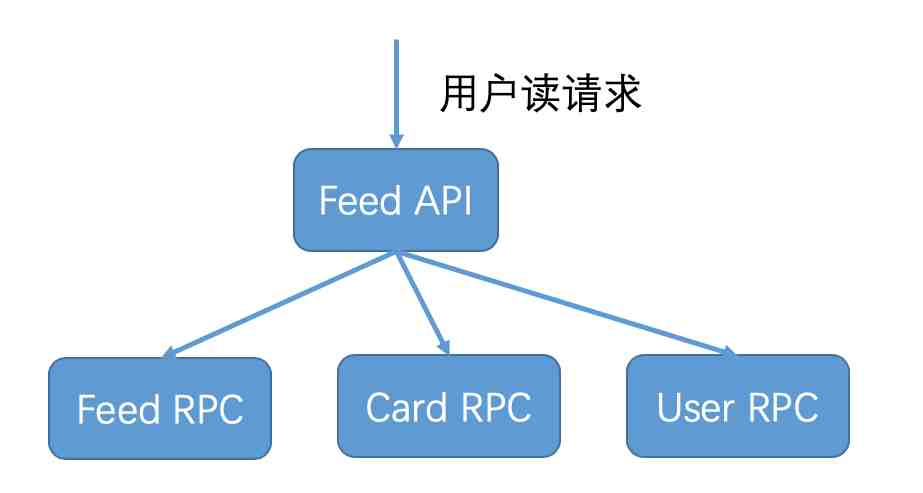
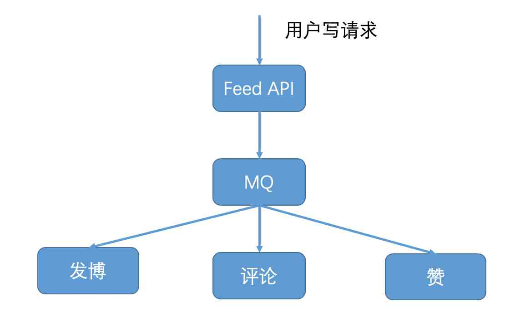

# 阿忠伯的特别放送 | 答疑解惑02

你好，我是胡忠想。今天我继续来给同学们做答疑，第二期答疑主要涉及微服务架构、注册中心和负载均衡算法，需要一定的基础，如果对这些内容不了解，可以先返回[专栏第 14 期](014.md)、[第 17 期](017.md)和[第 18 期](018.md)复习一下。

专栏里我主要讲的是基于 RPC 通信的微服务架构，除此之外还有一种微服务架构是基于 MQ 消息队列通信的，下面我就从这两种架构不同的适用场景来给你讲讲它们的区别。

基于 RPC 通信的微服务架构，其特点是一个服务依赖于其他服务返回的结果，只有依赖服务执行成功并返回后，这个服务才算调用成功。这种架构适用于用户请求是读请求的情况，就像下图所描述的那样，比如微博用户的一次 Feed API 请求，会调用 Feed RPC 获取关注人微博，调用 Card RPC 获取微博中的视频、文章等多媒体卡片信息，还会调用 User RPC 获取关注人的昵称和粉丝数等个人详细信息，只有在这些信息都获取成功后，这次用户的 Feed API 请求才算调用成功。

而基于 MQ 消息队列通信的架构，其特点是服务之间的交互是通过消息发布与订阅的方式来完成的，一个服务往 MQ 消息队列发布消息，其他服务从 MQ 消息队列订阅消息并处理，发布消息的服务并不等待订阅消息服务处理的结果，而是直接返回调用成功。这种架构适用于用户请求是写请求的情况，就像下图所描述的那样，比如用户的写请求，无论是发博、评论还是赞都会首先调用 Feed API，然后 Feed API 将用户的写请求消息发布到 MQ 中，然后就返回给用户请求成功。如果是发博请求，发博服务就会从 MQ 中订阅到这条消息，然后更新用户发博列表的缓存和数据库；如果是评论请求，评论服务就会从 MQ 中订阅到这条消息，然后更新用户发出评论的缓存和数据库，以及评论对象收到评论的缓存和数据库；如果是赞请求，赞服务就会从 MQ 中订阅到这条消息，然后更新用户发出赞的缓存和数据库，以及赞对象收到的赞的缓存和数据库。这样设计的话，就把写请求的返回与具体执行请求的服务进行解耦，给用户的体验是写请求已经执行成功，不需要等待具体业务逻辑执行完成。

总结一下就是，基于 RPC 通信和基于 MQ 消息队列通信的方式都可以实现微服务的拆分，两者的使用场景不同，RPC 主要用于用户读请求的情况，MQ 主要用于用户写请求的情况。对于大部分互联网业务来说，读请求要远远大于写请求，所以针对读请求的基于 RPC 通信的微服务架构的讨论也更多一些，但并不代表基于 MQ 消息队列不能实现，而是要区分开它们不同的应用场景。

要回答上面这三个问题，需要我来详细讲讲微博在使用注册中心时遇到的各种问题以及解决方案，主要包括三部分内容。
1. <b>心跳开关保护机制</b>。在专栏第 17 期，我讲过心跳开关保护机制是为了防止网络频繁抖动时，引起服务提供者节点心跳上报失败，从而导致注册中心中可用节点不断变化，使得大量服务消费者同时去请求注册中心获取最新的服务提供者节点列表，把注册中心的带宽占满。为了减缓注册中心带宽的占用，一个解决方案是，只给其中 1/10 的服务消费者返回最新的服务提供者节点列表信息，这样注册中心带宽就能减少到原来的 1/10。在具体实践时，我们每次随机取 10%，所以对于任意服务消费者来说，获取到最新服务提供者节点列表信息的时刻都是不固定的。在我的实践过程中，对于一个拥有上千个服务消费者的服务来说，某个服务消费者可能长达半小时后仍然没有获取到最新的服务提供者节点列表信息。所以说这种机制是有一定缺陷的，尤其是在服务正常情况下，心跳开关应该是关闭的，只有在网络频繁抖动时才打开。当网络频繁抖动时，注册中心的带宽就会暴涨，可以轻松把千兆网卡的前端机带宽打满，此时监控到带宽被打满时，就应该立即开启心跳开关保护机制。
2. <b>服务节点摘除保护机制</b>。设计心跳开关保护机制的目的，就是为了应对网络频繁抖动时引起的服务提供者节点心跳上报失败的情况。这个时候，注册中心会大量摘除服务提供者节点，从而引起服务提供者节点信息的变化。但其实大部分服务提供者节点本来是正常的，注册中心大量摘除服务提供者节点的情况是不应该发生的，所以可以设置一个服务节点摘除的保护机制，比如设置一个上限 20%，正常情况下也不会有 20% 的服务节点被摘除，这样的话即使网络频繁抖动，也不会有大量节点信息变更，此时就不会出现大量服务消费者同时请求注册中心获取最新的服务提供者节点列表，进而把注册中心的带宽给占满。但这个机制也有一个缺陷，就是一些异常的节点即使心跳汇报异常应该被摘除，但也会因为摘除保护机制的原因没有从服务的可用节点列表中去掉，因此可能会影响线上服务。
3. <b>静态注册中心机制</b>。心跳开关保护机制和服务节点摘除保护机制都是治标不治本的权宜之计，不能根本解决网络频繁抖动情况下，引起的注册中心可用服务节点列表不准确的问题。所以我们提出了静态注册中心的机制，也就是注册中心中保存的服务节点列表只作为服务消费者的参考依据，在每个服务消费者这一端都维护着各自的可用服务节点列表，是否把某个服务节点标记为不可用，完全取决于每个服务消费者自身调用某个服务节点是否正常。如果连续调用超过一定的次数都不正常，就可以把这个服务节点在内存中标记为不可用状态，从可用服务节点列表中剔除。同时每个服务消费者还都有一个异步线程，始终在探测不可用的服务节点列表中的节点是否恢复正常，如果恢复正常的话就可以把这个节点重新加入到可用服务节点列表中去。

关于最少活跃连接算法和自适应最优选择算法，它们的含义你可以返回[专栏第 18 期](018.md)回顾一下，本质上这两种算法都可以理解为局部最优解。

首先来看最少活跃连接算法，当客户端的请求发往某个服务端节点时，就给客户端同这个服务端节点的连接数加一；当某个服务端节点返回请求结果后，就给客户端同这个服务端节点的连接数减一，客户端会在本地内存中维护着同服务端每个节点的连接计数。从理论上讲，服务端节点性能越好，处理请求就快，同一时刻客户端同服务端节点之间保持的连接就越少，所以客户端每次请求选择服务端节点时，都会选择与客户端保持连接数最少的服务端节点，所以叫作“最少活跃连接算法”。但最少活跃连接算法会导致服务端节点的请求分布不均，我曾经在实践中见过一种极端情况，当服务端节点性能差异较大时，性能较好的节点的请求数量甚至达到了性能较差的节点请求数量的两倍。出现这种情况，一方面会导致某些服务端节点不能被充分利用，另一方面可能会导致请求量过高的服务端节点无法应对突发增长的流量而被压垮。

再来看下自适应最优选择算法，一方面客户端发往服务端节点每一次调用的耗时都会被记录到本地内存中，并且每隔一分钟计算客户端同服务端每个节点之间调用的平均响应时间，并在下一次调用的时候选择平均响应时间最快的节点。显然这样是收益最大的，尤其是服务跨多个数据中心部署的时候，同一个数据中心内的调用性能往往要优于跨数据中心的调用；另一方面客户端并不是每一次都选择平均响应时间最快的节点发起调用，为了防止出现类似最少活跃连接算法中服务端节点请求量差异太大的情况发生，把服务端节点按照平均响应时间进行排序，找出最差的 20% 的节点并适当降低调用权重，从而达到有效减少长尾请求的目的。