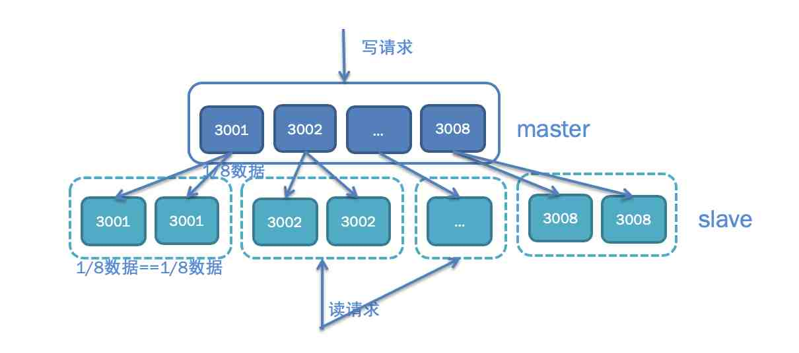
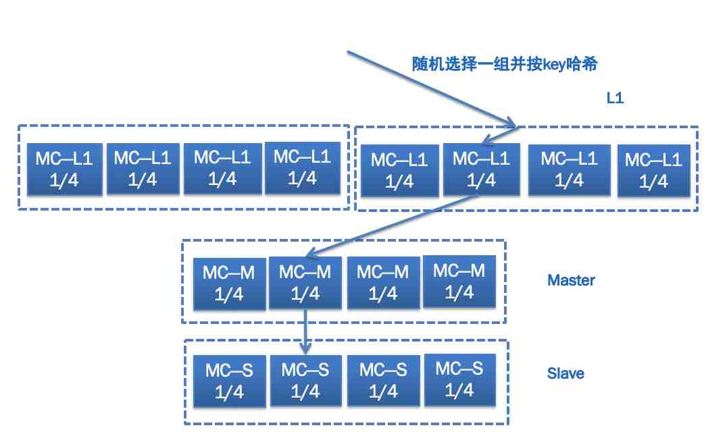
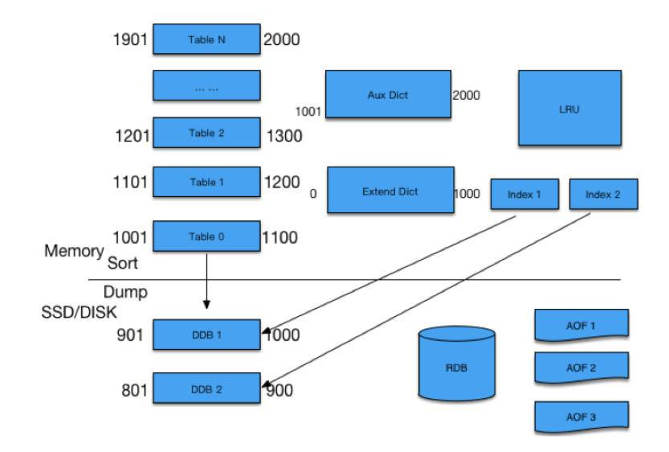
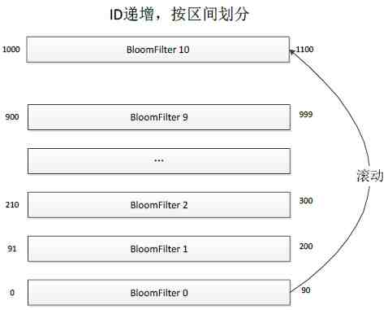
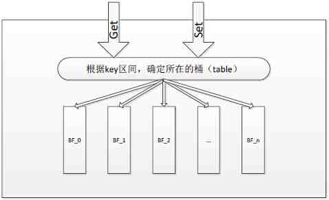
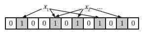

# 微博技术解密（下）| 微博存储的那些事儿

今天是微博技术解密系列的第二期，我们来聊聊微博存储的使用经验。上一期“微博技术解密”我讲到微博主要使用了两大类存储：一类是数据库，主要以 MySQL 为主；一类是缓存，主要以 Memcached 和 Redis 为主。

<b>今天我来分享一下微博在使用数据库和缓存方面的经验</b>，也欢迎你给我留言一起切磋讨论。

## MySQL

上一期我讲到微博 Feed 的存储使用了两层的结构，为了减少对 MySQL 数据库的访问压力，在前面部署了 Memcached 缓存，挡住了 99% 的访问压力，只有 1% 的请求会访问数据库。然而对于微博业务来说，这 1% 的请求也有几万 QPS，对于单机只能扛几千 QPS 的 MySQL 数据库来说还是太大了。为此我们又对数据库端口进行了拆分，你可以看下面的示意图，每个用户的 UID 是唯一的，不同 UID 的用户按照一定的 Hash 规则访问不同的端口，这样的话单个数据库端口的访问量就会变成原来的 1/8。除此之外，考虑到微博的读请求量要远大于写请求量，所以有必要对数据库的读写请求进行分离，写请求访问 Master，读请求访问 Slave，这样的话 Master 只需要一套，Slave 根据访问量的需要可以有多套，也就是“一主多从”的架构。最后考虑到灾备的需要，还会在异地部署一套冷备的灾备数据库，平时不对外提供线上服务，每天对所有最新的数据进行备份，以防线上数据库发生同时宕机的情况。

## Memcached

在 MySQL 数据库前面，还使用了 Memcached 作为缓存来承担几百万 QPS 的数据请求，产生的带宽问题是最大挑战。为此微博采用了下图所示的多层缓存结构，即 L1-Master-Slave，它们的作用各不相同。

L1 主要起到分担缓存带宽压力的作用，并且如果有需要可以无限进行横向扩展，任何一次数据请求，都随机请求其中一组 L1 缓存，这样的话，假如一共 10 组 L1，数据请求量是 200 万 QPS，那么每一组 L1 缓存的请求量就是 1/10，也就是 20 万 QPS；同时每一组缓存又包含了 4 台机器，按照用户 UID 进行 Hash，每一台机器只存储其中一部分数据，这样的话每一台机器的访问量就只有 1/4 了。

Master 主要起到防止访问穿透到数据库的作用，所以一般内存大小要比 L1 大得多，以存储尽可能多的数据。当 L1 缓存没有命中时，不能直接穿透到数据库，而是先访问 Master。

Slave 主要起到高可用的目的，以防止 Master 的缓存宕机时，从 L1 穿透访问的数据直接请求数据库，起到“兜底”的作用。

## Redis

微博的存储除了大量使用 MySQL 和 Memcached 以外，还有一种存储也被广泛使用，那就是 Redis。并且基于微博自身的业务特点，我们对原生的 Redis 进行了改造，因此诞生了两类主要的 Redis 存储组件：CounterService 和 Phantom。

### 1. CounterService

CounterService 的主要应用场景就是计数器，比如微博的转发、评论、赞的计数。早期微博曾采用了 Redis 来存储微博的转发、评论、赞计数，但随着微博的数据量越来越大，发现 Redis 内存的有效负荷还是比较低的，它一条 KV 大概需要至少 65 个字节，但实际上一条微博的计数 Key 需要 8 个字节，Value 大概 4 个字节，实际上有效的只有 12 个字节，其余四十多个字节都是被浪费的。这还只是单个 KV，如果一条微博有多个计数的情况下，它的浪费就更多了，比如转评赞三个计数，一个 Key 是 long 结构，占用 8 个字节，每个计数是 int 结构，占用 4 个字节，三个计数大概需要 20 个字节就够了；而使用 Redis 的话，需要将近 200 个字节。正因为如此，我们研发了 CounterService，相比 Redis 来说它的内存使用量减少到原来的 1/15～1/5。而且还进行了冷热数据分离，热数据放到内存里，冷数据放到磁盘上，并使用 LRU，如果冷数据重新变热，就重新放到内存中。

你可以看下面的示意图，CounterService 的存储结构上面是内存下面是 SSD，预先把内存分成 N 个 Table，每个 Table 根据微博 ID 的指针序列，划出一定范围。任何一个微博 ID 过来先找到它所在的 Table，如果有的话，直接对它进行增减；如果没有，就新增加一个 Key。有新的微博 ID 过来，发现内存不够的时候，就会把最小的 Table dump 到 SSD 里面去，留着新的位置放在最上面供新的微博 ID 来使用。如果某一条微博特别热，转发、评论或者赞计数超过了 4 个字节，计数变得很大该怎么处理呢？对于超过限制的，我们把它放在 Aux Dict 进行存放，对于落在 SSD 里面的 Table，我们有专门的 Index 进行访问，通过 RDB 方式进行复制。

### 2. Phantom

微博还有一种场景是“存在性判断”，比如某一条微博某个用户是否赞过、某一条微博某个用户是否看过之类的。这种场景有个很大的特点，它检查是否存在，因此每条记录非常小，比如 Value 用 1 个位存储就够了，但总数据量又非常巨大。比如每天新发布的微博数量在 1 亿条左右，是否被用户读过的总数据量可能有上千亿，怎么存储是个非常大的挑战。而且还有一个特点是，大多数微博是否被用户读过的存在性都是 0，如果存储 0 的话，每天就得存上千亿的记录；如果不存的话，就会有大量的请求最终会穿透 Cache 层到 DB 层，任何 DB 都没有办法抗住那么大的流量。

假设每天要存储上千亿条记录，用原生的 Redis 存储显然是不可行的，因为原生的 Redis，单个 KV 就占了 65 个字节，这样每天存储上千亿条记录，需要增加将近 6TB 存储，显然是不可接受的。而用上面提到的微博自研的 CounterService 来存储的话，一个 Key 占 8 个字节，Value 用 1 个位存储就够了，一个 KV 就占大约 8 个字节，这样每天存储上千亿条记录，需要增加将近 800GB 存储。虽然相比于原生的 Redis 存储方案，已经节省了很多，但存储成本依然很高，每天将近 1TB。

所以就迫切需要一种更加精密的存储方案，针对存在性判断的场景能够最大限度优化存储空间，后来我们就自研了 Phantom。

就像下图所描述的那样，Phantom 跟 CounterService 一样，采取了分 Table 的存储方案，不同的是 CounterService 中每个 Table 存储的是 KV，而 Phantom 的每个 Table 是一个完整的 BloomFilter，每个 BloomFilter 存储的某个 ID 范围段的 Key，所有 Table 形成一个列表并按照 Key 范围有序递增。当所有 Table 都存满的时候，就把最小的 Table 数据清除，存储最新的 Key，这样的话最小的 Table 就滚动成为最大的 Table 了。

下图描述了 Phantom 的请求处理过程，当一个 Key 的读写请求过来时，先根据 Key 的范围确定这个 Key 属于哪个 Table，然后再根据 BloomFilter 的算法判断这个 Key 是否存在。

这里我简单介绍一下 BloomFilter 是如何判断一个 Key 是否存在的，感兴趣的同学可以自己搜索一下 BloomFilter 算法的详细说明。为了判断某个 Key 是否存在，BloomFilter 通过三次 Hash 函数到 Table 的不同位置，然后判断这三个位置的值是否为 1，如果都是 1 则证明 Key 存在。

来看下面这张图，假设 x1 和 x2 存在，就把 x1 和 x2 通过 Hash 后找到的三个位置都设置成 1。

再看下面这张图，判断 y1 和 y2 是否存在，就看 y1 和 y2 通过 Hash 后找到的三个位置是否都是 1。比如图中 y1 第二个位置是 0，说明 y1 不存在；而 y2 的三个位置都是 1，说明 y2 存在。

Phantom 正是通过把内存分成 N 个 Table，每一个 Table 内使用 BloomFilter 判断是否存在，最终每天使用的内存只有 120GB。而存在性判断的业务场景最高需要满足一周的需求，所以最多使用的内存也就是 840GB。

## 总结

今天我给你讲解了微博业务中使用范围最广的三个存储组件：一个是 MySQL，主要用作持久化存储数据，由于微博数据访问量大，所以进行了数据库端口的拆分来降低单个数据库端口的请求压力，并且进行了读写分离和异地灾备，采用了 Master-Slave-Backup 的架构；一个是 Memcached，主要用作数据库前的缓存，减少对数据库访问的穿透并提高访问性能，采用了 L1-Master-Slave 的架构；一个是 Redis，基于微博自身业务需要，我们对 Redis 进行了改造，自研了 CounterService 和 Phantom，分别用于存储微博计数和存在性判断，大大减少了对内存的使用，节省了大量机器成本。