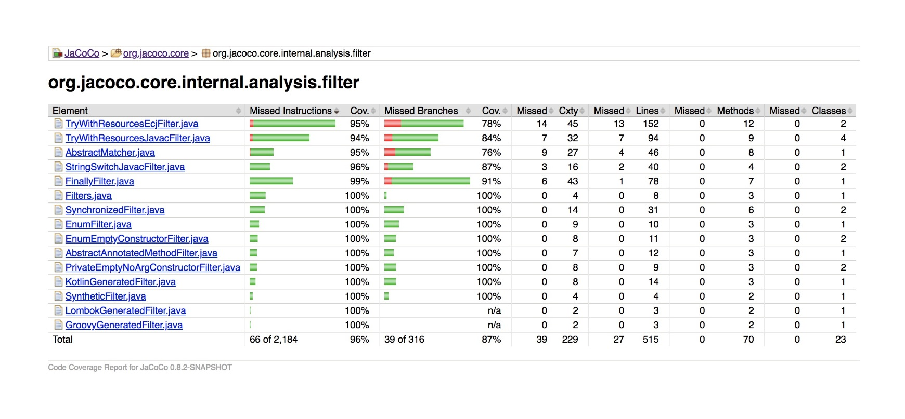
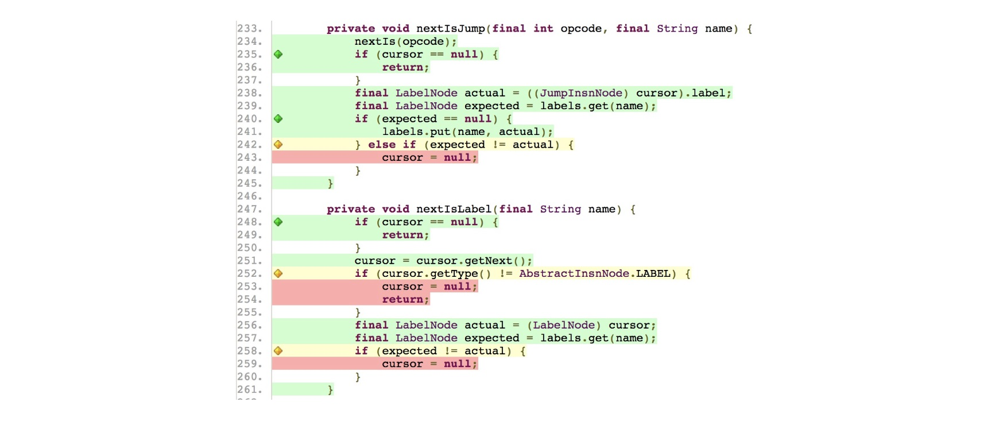
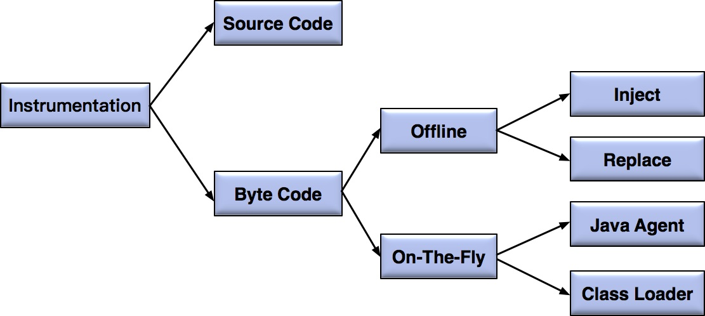

# 你真的懂测试覆盖率吗？

在上一篇文章中，我为你介绍了软件测试各个阶段的自动化技术，在前面的文章中我也提到了测试覆盖率的概念，你当时可能有点不明白，那么今天我就和你详细聊聊测试覆盖率这个主题。

<b>测试覆盖率通常被用来衡量测试的充分性和完整性，从广义的角度来讲，测试覆盖率主要分为两大类，一类是面向项目的需求覆盖率，另一类是更偏向技术的代码覆盖率。</b>

## 需求覆盖率

<b>需求覆盖率是指测试对需求的覆盖程度，通常的做法是将每一条分解后的软件需求和对应的测试建立一对多的映射关系，最终目标是保证测试可以覆盖每个需求，以保证软件产品的质量。</b>

我们通常采用 ALM，Doors 和 TestLink 等需求管理工具来建立需求和测试的对应关系，并以此计算测试覆盖率。

需求覆盖率统计方法属于传统瀑布模型下的软件工程实践，传统瀑布模型追求自上而下地制定计划、分析需求、设计软件、编写代码、测试和运维等，在流程上是重量级的，已经很难适应当今互联网时代下的敏捷开发实践。

所以，互联网测试项目中很少直接基于需求来衡量测试覆盖率，而是将软件需求转换成测试需求，然后基于测试需求再来设计测试点。

因此，现在人们口中的测试覆盖率，通常默认指代码覆盖率，而不是需求覆盖率。

## 代码覆盖率

<b>简单来说，代码覆盖率是指，至少被执行了一次的条目数占整个条目数的百分比。</b>

如果“条目数”是语句，对应的就是代码行覆盖率；如果“条目数”是函数，对应的就是函数覆盖率；如果“条目数”是路径，那么对应的就是路径覆盖率。依此类推，你就可以得到绝大多数常见的代码覆盖率类型的定义。

这里我给你简单介绍一下最常用的三种代码覆盖率指标。
- 行覆盖率又称为语句覆盖率，指已经被执行到的语句占总可执行语句（不包含类似 C++ 的头文件声明、代码注释、空行等等）的百分比。这是最常用也是要求最低的覆盖率指标。实际项目中通常会结合判定覆盖率或者条件覆盖率一起使用。
- 判定覆盖又称分支覆盖，用以度量程序中每一个判定的分支是否都被测试到了，即代码中每个判断的取真分支和取假分支是否各被覆盖至少各一次。比如，对于 if(a&gt;0 &amp;&amp; b&gt;0)，就要求覆盖“a&gt;0 &amp;&amp; b&gt;0”为 TURE 和 FALSE 各一次。
- 条件覆盖是指，判定中的每个条件的可能取值至少满足一次，度量判定中的每个条件的结果 TRUE 和 FALSE 是否都被测试到了。比如，对于 if(a&gt;0 &amp;&amp; b&gt;0)，就要求“a&gt;0”取 TRUE 和 FALSE 各一次，同时要求“b&gt;0”取 TRUE 和 FALSE 各一次。

## 代码覆盖率的价值

<b>现在很多项目都在单元测试以及集成测试阶段统计代码覆盖率，但是我想说的是，统计代码覆盖率仅仅是手段，你必须透过现象看到事物的本质，才能从根本上保证软件整体的质量。</b>

<b>统计代码覆盖率的根本目的是找出潜在的遗漏测试用例，并有针对性的进行补充，同时还可以识别出代码中那些由于需求变更等原因造成的不可达的废弃代码。</b>

通常我们希望代码覆盖率越高越好，代码覆盖率越高越能说明你的测试用例设计是充分且完备的，但你也会发现测试的成本会随着代码覆盖率的提高以类似指数级的方式迅速增加。

如果想达到 70% 的代码覆盖率，你可能只需要 30 分钟的时间成本。但如果你想把代码覆盖率提高到 90%，那么为了这额外的 20%，你可能花的时间就远不止 30 分钟了。更进一步，你如果想达到 100% 的代码覆盖率，可想而知你花费的代价就会更大了。

那么，为什么代码覆盖率的提高，需要付出越来越大的代价呢？因为在后期，你需要大量的桩代码、Mock 代码和全局变量的配合来控制执行路径。

所以，在软件企业中，只有单元测试阶段对代码覆盖率有较高的要求。因为从技术实现上讲，单元测试可以最大化地利用打桩技术来提高覆盖率。而你如果想在集成测试或者是 GUI 测试阶段将代码覆盖率提高到一定量级，那你所要付出的代价是巨大的，而且在很多情况下根本就实现不了。

## 代码覆盖率的局限性

我先来问你一个问题，如果你通过努力，已经把某个函数的 MC/DC 代码覆盖率（MC/DC 覆盖率是最高标准的代码覆盖率指标，除了直接关系人生命安全的软件以外，很少会有项目会有严格的 MC/DC 覆盖率要求）做到了 100%，软件质量是否就真的高枕无忧、万无一失了呢？

很不幸，即使你所设计的测试用例已经达到 100% 的代码覆盖率，软件产品的质量也做不到万无一失。其根本原因在于代码覆盖率的计算是基于现有代码的，并不能发现那些“未考虑某些输入”以及“未处理某些情况”形成的缺陷。

我给你举个极端的例子，如果一个被测函数里面只有一行代码，只要这个函数被调用过了，那么衡量这一行代码质量的所有覆盖率指标都会是 100%，但是这个函数是否真正实现了应该需要实现的功能呢？

显然，代码覆盖率反映的仅仅是已有代码的哪些逻辑被执行过了，哪些逻辑还没有被执行过。以此为依据，你可以补充测试用例，可以去测试那些还没有覆盖到的执行路径。但也是仅此而已，对于那些压根还没有代码实现的部分，基于代码覆盖率的统计指标就无能为力了。

<b>总结来讲，高的代码覆盖率不一定能保证软件的质量，但是低的代码覆盖率一定不能能保证软件的质量。</b>

好了，现在你已经了解了代码覆盖率的概念、价值和局限性，那么接下来，我就以 Java 代码覆盖率工具为例，给你解释一下代码覆盖率工具的内部实现原理以及一些关键技术。

当你理解了这部分内容，以后再面对各个不同开发语言的不同代码覆盖率工具时，就可以做到胸有成竹地根据具体的项目性质，选择最合适的代码覆盖率工具了。

## 代码覆盖率工具

JaCoCo 是一款 Java 代码的主流开源覆盖率工具，可以很方便地嵌入到 Ant、Maven 中，并且和很多主流的持续集成工具以及代码静态检查工具，比如 Jekins 和 Sonar 等，都有很好的集成。

首先，我先带你看看 JaCoCo 的代码覆盖率报告长什么样子。

如图 1 所示为 JaCoCo 的整体代码覆盖率统计报告，包括了每个 Java 代码文件的行覆盖率以及分支覆盖率统计，并给出了每个 Java 代码文件的行数、方法数和类数等具体信息。

<b>图 1 JaCoCo 代码覆盖率统计报告实例</b>

如图 2 所示为每个 Java 文件内部详细的代码覆盖率情况，图中绿色的行表示已经被覆盖，红色的行表示尚未被覆盖，黄色的行表示部分覆盖；左侧绿色菱形块表示该分支已经被完全覆盖、黄色菱形块表示该分支仅被部分覆盖。

<b>图 2 JaCoCo 详细代码覆盖率实例</b>

显然，通过这个详尽的报告，你就可以知道代码真实的执行情况、哪些代码未被覆盖。以此为基础，你再去设计测试用例就会更有针对性了。

## 代码覆盖率工具的实现原理

JaCoCo 的详细报告，让你惊叹于代码覆盖率工具的强大。但你有没有仔细想过，这样的统计信息如何被获取到的呢？

<b>图 3 统计代码覆盖率的不同注入实现技术</b>

<b>实现代码覆盖率的统计，最基本的方法就是注入（Instrumentation）。简单地说，注入就是在被测代码中自动插入用于覆盖率统计的探针（Probe）代码，并保证插入的探针代码不会给原代码带来任何影响。</b>

对于 Java 代码来讲，根据注入目标的不同，可以分为源代码（Source Code）注入和字节码（Byte Code）注入两大类。基于 JVM 本身特性以及执行效率的原因，目前主流的工具基本都是使用字节码注入，注入的具体实现采用 ASM 技术。

ASM 是一个 Java 字节码操纵框架，能被用来动态生成类或者增强既有类的功能，可以直接产生 class 文件，也可以在类被加载入 JVM 之前动态改变类行为。
根据注入发生的时间点，字节码注入又可以分为两大模式：On-The-Fly 注入模式和 Offline 注入模式。

### 第一，On-The-Fly 注入模式

On-The-Fly 模式的特点在于无需修改源代码，也无需提前进行字节码插桩。它适用于支持 Java Agent 的运行环境。

这样做的优点是，可以在系统不停机的情况下，实时收集代码覆盖率信息。缺点是运行环境必须允许使用 Java Agent。

实现 On-The-Fly 模式，主要有两种技术方案：
1. 开发自定义的类装载器（Class Loader）实现类装载策略，每次类加载前，需要在 class 文件中插入探针，早期的 Emma 就是使用这种方案实现的探针插入；
2. 借助 Java Agent，利用执行在 main() 方法之前的拦截器方法 premain() 来插入探针，实际使用过程中需要在 JVM 的启动参数中添加“-javaagent”并指定用于实时字节码注入的代理程序，这样代理程序在装载每个 class 文件前，先判断是否已经插入了探针，如果没有则需要将探针插入 class 文件中，目前主流的 JaCoCo 就是使用了这个方式。

### 第二，Offline 注入模式

Offline 模式也无需修改源代码，但是需要在测试开始之前先对文件进行插桩，并事先生成插过桩的 class 文件。它适用于不支持 Java Agent 的运行环境，以及无法使用自定义类装载器的场景。

这样做的优点是，JVM 启动时不再需要使用 Java Agent 额外开启代理，缺点是无法实时获取代码覆盖率信息，只能在系统停机时下获取。

Offline 模式根据是生成新的 class 文件还是直接修改原 class 文件，又可以分为 Replace 和 Inject 两种不同模式。

和 On-The-Fly 注入模式不同，Replace 和 Inject 的实现是，在测试运行前就已经通过 ASM 将探针插入了 class 文件，而在测试的运行过程中不需要任何额外的处理。Cobertura 就是使用 Offline 模式的典型代表。

## 总结

测试覆盖率通常被用来衡量测试的充分性和完整性，包括面向项目的需求覆盖率和更偏向技术的代码覆盖率。而需求覆盖率的统计方式不再适用于现在的敏捷开发模式，所以现在谈到测试覆盖率，大多是指代码覆盖率。
但是，高的代码覆盖率不一定能保证软件的质量，因为代码覆盖率是基于现有代码，无法发现那些“未考虑某些输入”以及“未处理某些情况”形成的缺陷。
另外，对于代码覆盖率的统计工具，我希望你不仅仅是会用的层次，而是能够理解它们的原理，知其然知其所以然，才能更好地利用这些工具完成你的测试工作。

## 思考题

你在实际工作中，是否还接触过 C/C++，JavaScript 等语言的代码覆盖率工具，比如 GCC Coverage、JSCoverage 和 Istanbul 等？如果接触过的话，请你谈谈自己使用的感受以及遇到过的“坑”。
欢迎你给我留言。