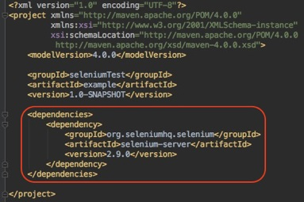
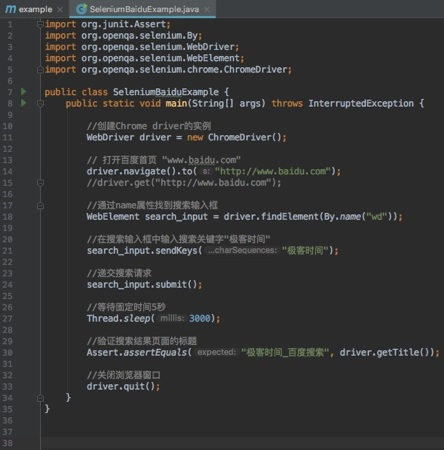
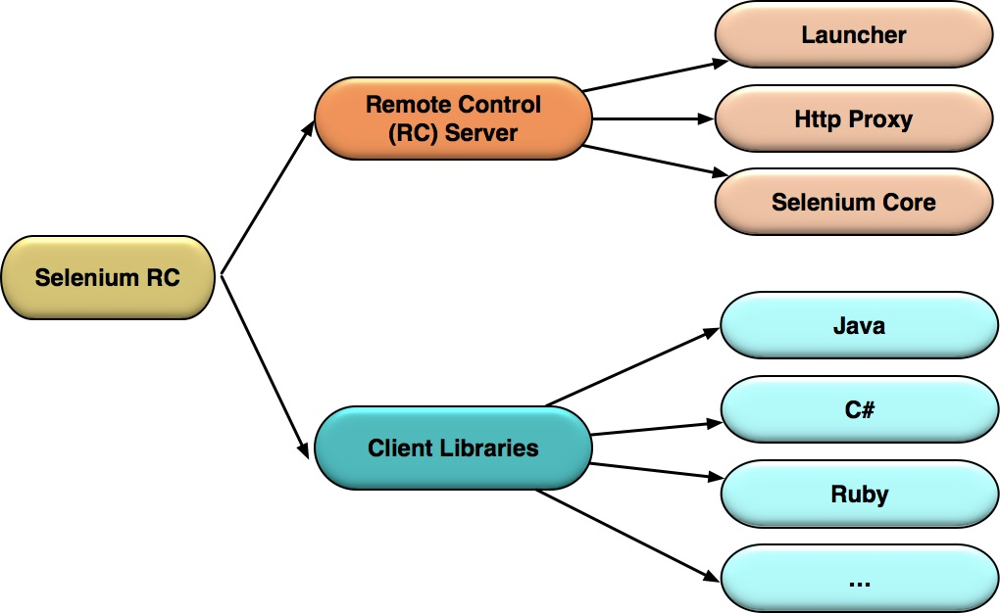
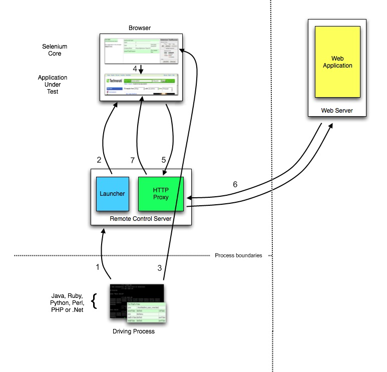
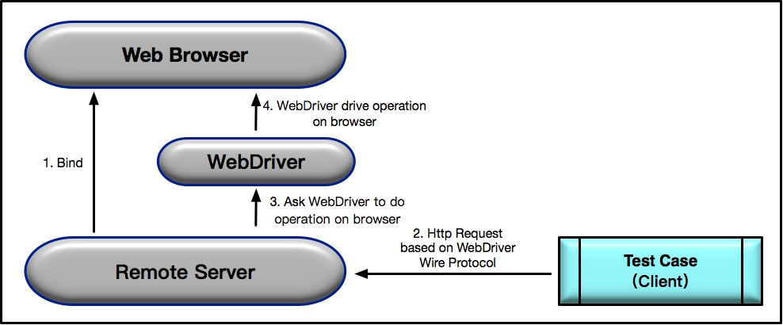

# 从0到1：你的第一个GUI自动化测试

在前面的测试基础知识系列文章中，我分享了测试相关的基础知识，从测试用例的设计，到测试覆盖率，再到测试计划的制定，这些都是我认为测试人要掌握的一些基本知识。

那么，接下来我将要带你走入 GUI 自动化测试的世界，和你一起聊聊 GUI 自动化测试的技术、原理和行业最佳实践。

作为该系列的第一篇文章，我直接以一个最简单的 GUI 自动化用例的开发为例，带你从 0 开始构建一个 Selenium 的 GUI 自动化测试用例。

先让你对 GUI 自动化测试有一个感性认识，然后以此为基础，我再来解释 Selenium 自动化测试实现的核心原理与机制，希望可以帮你由点到面建立起 GUI 测试的基础知识体系。

## 构建一个 Selenium 自动化测试用例示例

测试需求非常简单：访问百度主页，搜索某个关键词，并验证搜索结果页面的标题是“被搜索的关键词”+“_ 百度搜索”。

如果搜索的关键词是“极客时间”，那么搜索结果页面的标题就应该是“极客时间 _ 百度搜索”。

明白了测试需求后，我强烈建议你先用手工方式执行一遍测试，具体步骤是：
1. 打开 Chrome 浏览器，输入百度的网址[“www.baidu.com”](http://www.baidu.com)；
2. 在搜索输入框中输入关键词“极客时间”并按下回车键；
3. 验证搜索结果页面的标题是否是“极客时间 _ 百度搜索”。

明确了 GUI 测试的具体步骤后，我们就可以用 Java 代码，基于 Selenium 实现这个测试用例了。

这里，我要用到 Chrome 浏览器，所以需要先下载 Chrome  Driver 并将其放入环境变量。接下来，你可以用自己熟悉的方式建立一个空的 Maven 项目，然后在 POM 文件中加入 Selenium 2.0 的依赖，如图 1 所示。

图1在 POM 文件中加入 Selenium 2.0 的依赖

接着用 Java 创建一个 main 方法，并把如图 2 所示的代码复制到你的 main 方法中。

图2基于 Selenium 的自动化测试用例的样本代码

现在，你可以尝试运行这个 main 方法，看看会执行哪些操作。
1. 这段代码会自动在你的电脑上打开 Chrome 浏览器；
2. 在 URL 栏自动输入[“www.baidu.com”](http://www.baidu.com)；
3. 百度主页打开后，在输入框自动输入“极客时间”并执行搜索；
4. 返回搜索结果页面；
5. Chrome 浏览器自动退出。

以上这些步骤都是由自动化测试代码自动完成的。

如果你已经接触过 GUI 自动化测试，你可能习以为常了，感觉没什么神奇的。但如果你是第一次接触 GUI 自动化测试，是不是觉得还蛮有意思的。

现在，我来快速解读一下这些代码，你可以看看这些自动化步骤是怎么实现的，更具体的原理和内部机制我会在后面文章中详细展开。
- 第11行，WebDriver driver = new ChromeDriver()，先创建一个 Chrome Driver 的实例，也就是打开了 Chrome 浏览器，但实际上没这么简单，后台还做了些额外的 Web Service 绑定工作，具体后面会解释；
- 第14行，driver.navigate().to(s: [“http://www.baidu.com](http://www.baidu.com)”) 用刚才已经打开的 Chrome 浏览器访问百度主页；
- 第18行，WebElement search_input = driver.findElement(<a href="http://By.name">By.name</a>(“wd”))，使用 driver 的 findElement 方法，并通过 name 属性定位到了搜索输入框，并将该搜索输入框命名为 search_input；
- 第21行，search_input.sendKeys(…charSequences:“极客时间”)，通过 WebElement 的 sendKeys 方法向搜索输入框 search_input 输入了字符串“极客时间”；
- 第24行，search_input.submit()，递交了搜索请求；
- 第27行，Thread.sleep(millis:3000)，强行等待了固定的 3 秒时间；
- 第30行，Assert.assertEquals(expected:“极客时间 _ 百度搜索”,driver.getTitle())，通过 junit 的 assertEquals 比较了浏览器的标题与预计结果，其中页面标题通过 driver 的 getTitle 方法得到，如果标题与预计结果一致，测试通过，否则测试失败；
- 第33行，driver.quit()，显式关闭了 Chrome 浏览器。

现在，你对 main 方法中的代码，已经比较清楚了。但是，你知道 Selenium 内部是如何实现 Web 自动化操作的吗？这就要从 Selenium 的历史版本和基本原理开始讲起了。

## Selenium 的实现原理

首先，你要明确刚才建立的测试用例是基于 Selenium 2.0，也就是 Selenium + WebDriver 的方案。

其次，你需要知道，对 Selenium 而言，V1.0 和 V2.0 版本的技术方案是截然不同的，V1.0 的核心是 Selenium RC，而 V2.0 的核心是 WebDriver，可以说这完全是两个东西。

最后，Selenium 3.0 也已经发布一段时间了，V3.0 相比 V2.0 并没有本质上的变化，主要是增加了对 MacOS 的 Safari 和 Windows 的 Edge 的支持，并彻底删除了对 Selenium RC 的支持。

所以接下来，我会针对 V1.0 和 V2.0 来解释 Selenium 实现 Web 自动化的原理。

### 第一，Selenium 1.0 的工作原理

<b>Selenium 1.0，又称 Selenium RC，其中 RC 是 Remote Control 的缩写。Selenium RC 利用的原理是：JavaScript 代码可以很方便地获取页面上的任何元素并执行各种操作。</b>

但是因为 " 同源政策（Same-origin policy）"（只有来自相同域名、端口和协议的 JavaScript 代码才能被浏览器执行），所以要想在测试用例运行中的浏览器中，注入 JavaScript 代码从而实现自动化的 Web 操作，Selenium RC 就必须“欺骗”被测站点，让它误以为被注入的代码是同源的。

那如何实现“欺骗”呢？这其实就是引入 Selenium RC Server 的根本原因，其中的 Http Proxy 模块就是用来“欺骗”浏览器的。

除了 Selenium RC Server，Selenium RC 方案的另一大部分就是，Client Libraries。它们的具体关系如图 3 所示。

图3 Selenium RC 的基本模块

<b>Selenium RC Server，主要包括 Selenium Core，Http Proxy 和 Launcher 三部分：</b>
- Selenium Core，是被注入到浏览器页面中的 JavaScript 函数集合，用来实现界面元素的识别和操作；
- Http Proxy，作为代理服务器修改 JavaScript 的源，以达到“欺骗”被测站点的目的；
- Launcher，用来在启动测试浏览器时完成 Selenium Core 的注入和浏览器代理的设置。

<b>Client Libraries，是测试用例代码向 Selenium RC Server 发送 Http 请求的接口，支持多种语言</b>，包括 Java、C# 和 Ruby 等。

为了帮你更好地理解 Selenium RC 的基本原理，我从 Selenium 的官方网站截取了以下执行流程图，并把具体的 7 个步骤做了如下翻译。

图4 Selenium RC 的执行流程

1. 测试用例通过基于不同语言的 Client Libraries 向 Selenium RC Server 发送 Http 请求，要求与其建立连接。
2. 连接建立后，Selenium RC Server 的 Launcher 就会启动浏览器或者重用之前已经打开的浏览器，把 Selenium Core（JavaScript 函数的集合）加载到浏览器页面当中，并同时把浏览器的代理设置为 Http Proxy。
3. 测试用例通过 Client Libraries 向 Selenium RC Server 发送 Http 请求，Selenium RC Server 解析请求，然后通过 Http Proxy 发送 JavaScript 命令通知 Selenium Core 执行浏览器上控件的具体操作。
4. Selenium Core 接收到指令后，执行操作。
5. 如果浏览器收到新的页面请求信息，则会发送 Http 请求来请求新的 Web 页面。由于 Launcher 在启动浏览器时把 Http Proxy 设置成为了浏览器的代理，所以 Selenium RC Server 会接收到所有由它启动的浏览器发送的请求。
6. Selenium RC Server 接收到浏览器发送的 Http 请求后，重组 Http 请求以规避“同源策略”，然后获取对应的 Web 页面。
7. Http Proxy 把接收的 Web 页面返回给浏览器，浏览器对接收的页面进行渲染。

### 第二，Selenium 2.0 的工作原理

接下来，我们回到上面那个百度搜索的测试用例，这个测试用例用的就是 Selenium 2.0。<b>Selenium 2.0，又称 Selenium WebDriver，它利用的原理是：使用浏览器原生的 WebDriver 实现页面操作。</b>它的实现方式完全不同于 Selenium 1.0。

Selenium WebDriver 是典型的 Server-Client 模式，Server 端就是 Remote Server。以下是 Selenium 2.0 工作原理的解析。

图5 Selenium WebDriver 的执行流程

1. 当使用 Selenium2.0 启动浏览器 Web Browser 时，后台会同时启动基于 WebDriver Wire 协议的 Web Service 作为 Selenium 的 Remote Server，并将其与浏览器绑定。绑定完成后，Remote Server 就开始监听 Client 端的操作请求。
2. 执行测试时，测试用例会作为 Client 端，将需要执行的页面操作请求以 Http Request 的方式发送给 Remote Server。该 HTTP Request 的 body，是以 WebDriver Wire 协议规定的 JSON 格式来描述需要浏览器执行的具体操作。
3. Remote Server 接收到请求后，会对请求进行解析，并将解析结果发给 WebDriver，由 WebDriver 实际执行浏览器的操作。
4. WebDriver 可以看做是直接操作浏览器的原生组件（Native Component），所以搭建测试环境时，通常都需要先下载浏览器对应的 WebDriver。

## 总结

首先，我基于 Selenium 2.0，带你从 0 到 1 建立了一个最简单直接的 GUI 自动化测试用例。这个用例的实现很简单，但是只有真正理解了 Selenium 工具的原理，你才能真正用好它。

所以，我又分享了 Selenium 1.0 和 Selenium 2.0 的内部实现机制和原理：Selenium 1.0 的核心是，基于 JavaScript 代码注入；而 Selenium 2.0 的核心是，运用了浏览器原生支持的 WebDriver。

## 思考题

除了 Selenium，业内还有很多常用的 GUI 自动化测试框架，比如 UFT（以前的 QTP）、RFT、Nightwatch 等，你在平时的工作中接触过哪些 GUI 自动化测试框架？你知道它们的内部实现原理吗？