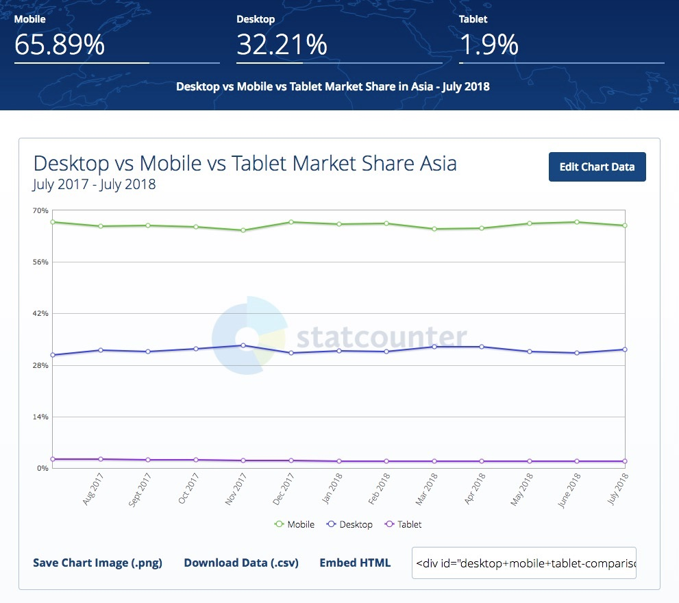
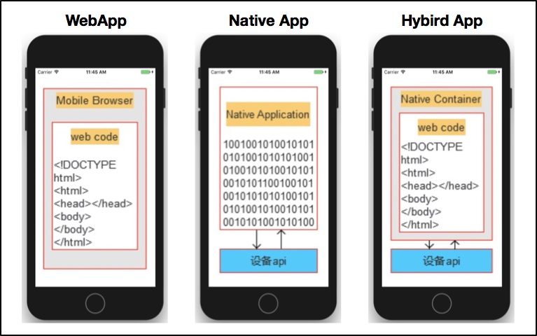
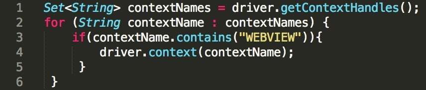

# 与时俱进：浅谈移动应用测试方法与思路

你好，我是茹炳晟。我今天分享的主题是“与时俱进：浅谈移动应用测试方法与思路”。

在 GUI 自动化测试这个系列，我讲了很多基于浏览器的业务测试的内容，你可能会说，现在移动 App 大行其道，对移动应用测试的方法和思路才更重要。

确实，现今移动互联网蓬勃发展，很多互联网应用的流量大部分已经不是来自于传统 PC 端的 Web 浏览器，而是来自于移动端。

图1展示了最近12个月来亚洲地区的流量分布统计，可见，现如今将近三分之二的流量是来自于手机端的，剩下的三分之一来自于传统 PC 端，还有很少一部分流量来自于平板电脑（其实这部分也可以归为移动端）。

图1  Mobile 端和 PC 端流量统计数据

但是，在我看来无论是移动端测试还是 PC 端测试，都属于 GUI 测试的范畴，所以基本的测试思路，比如基于页面对象封装和基于业务流程封装的思想是相通的，之前介绍的那些脚本分层的实现方法也都同样适用于移动端的 GUI 测试。

与此同时，移动端应用的测试也会因为其自身特点，有一些独特的测试方法与思路。严格来讲，移动端应用又可以进一步细分为三大类：Web  App、Native App 和 Hybrid App。所以，我今天分享的内容重点就是，这三类移动应用的测试方法，以及移动专项测试的思路与方法。<!-- [[[read_end]]] -->
## 三类移动应用的特点

<b>Web App 指的是移动端的 Web 浏览器，</b> 其实和 PC 端的 Web 浏览器没有任何区别，只不过 Web 浏览器所依附的操作系统不再是 Windows 和 Linux 了，而是 iOS 和 Android 了。

Web  App 采用的技术主要是，传统的 HTML、JavaScript、CSS 等 Web 技术栈，当然现在 HTML5 也得到了广泛的应用。另外，Web App 所访问的页面内容都是放在服务器端的，本质上就是 Web 网页，所以天生就是跨平台的。

<b>Native App 指的是移动端的原生应用，</b> 对于 Android 是 apk，对于 iOS 就是 ipa。Native App 是一种基于手机操作系统（iOS 和 Android），并使用原生程序编写运行的第三方应用程序。

Native App 的开发，Android 使用的语言通常是 Java，iOS 使用的语言是 Objective-C。通常来说，Native App 可以提供比较好的用户体验以及性能，而且可以方便地操作手机本地资源。

<b>Hybrid App（俗称：混血应用），是介于 Web  App 和 Native App 两者之间的一种 App 形式。</b>

Hybrid App 利用了 Web  App 和 Native App 的优点，通过一个原生实现的 Native Container 展示 HTML5 的页面。更通俗的讲法可以归结为，在原生移动应用中嵌入了 Webview，然后通过该 Webview 来访问网页。

Hybrid App 具有维护更新简单，用户体验优异以及较好的跨平台特性，是目前主流的移动应用开发模式。

图2三类移动应用的架构原理

## 三类不同移动应用的测试方法

了解了 Web App、Native App 和 Hybrid App 这三类应用的特性，接下来，我就跟你说说它们的测试方法。

好了，我们已经知道了移动应用的三个主要种类，接下来我们从测试的角度再来看看这三类不同的移动应用。

对于 Web  App，显然其本质就是 Web 浏览器的测试，我在前面文章中介绍的所有 GUI 自动化测试的方法和技术，比如数据驱动、页面对象模型、业务流程封装等，都适用于 Web App 的测试。

如果你的 Web 页面是基于自适应网页设计（即符合 Responsive Web 设计的规范），而且你的测试框架如果支持 Responsive Page，那么原则上你之前开发的运行在 PC Web 端的 GUI 自动化测试用例，不做任何修改就可以直接在移动端的浏览器上直接执行，当然运行的前提是你的移动端浏览器必须支持 Web Driver。

其中，自适应网页设计（Responsive Web Design）是指，同一个网页能够自动识别屏幕分辨率、并做出相应调整的网页设计技术。比如，图 3 所示的例子就是同一个网页在不同分辨率下的不同展示效果。

图3自适应网页设计实例

对 Native App 的测试，虽然不同的平台会使用不同的自动化测试方案（比如，iOS 一般采用 XCUITest Driver，而 Android 一般采用 UiAutomator2 或者 Espresso 等），但是数据驱动、页面对象以及业务流程封装的思想依旧适用，你完全可以把这些方法应用到测试用例设计中。

对 Hybrid App 的测试，情况会稍微复杂一点，对 Native Container 的测试，可能需要用到 XCUITest 或者 UiAutomator2 这样的原生测试框架，而对 Container 中 HTML5 的测试，基本和传统的网页测试没什么区别，所以原本基于 GUI 的测试思想和方法都能继续适用。

唯一需要注意的是，Native Container 和 Webview 分别属于两个不同的上下文（Context），Native Container 默认的 Context 为“NATIVE APP"，而 Webview 默认的 Context 为“WEBVIEW_+ 被测进程名称”。

所以，当需要操作 Webview 中的网页元素时，需要先切换到 Webview 的 Context 下，如图 4 所示代码就完成了这一切换操作。

图4 Hybrid App 中切换 Context 的代码示例

如此看来，移动端的测试除了使用的测试框架不同以外，测试设计本身和 GUI 测试有异曲同工之妙，似乎并没有什么新的内容，那真的是这样吗？

答案显然是否定的。

## 移动应用专项测试的思路和方法

对于移动应用，顺利完成全部业务功能测试往往是不够的。如果你的关注点只是业务功能测试，那么，当你的移动应用被大量用户安装和使用时，就会暴露出很多之前完全没有预料到的问题，比如：
- 流量使用过多；
- 耗电量过大；
- 在某些设备终端上出现崩溃或者闪退的现象；
- 多个移动应用相互切换后，行为异常；
- 在某些设备终端上无法顺利安装或卸载；
- 弱网络环境下，无法正常使用；
- Android 环境下，经常出现 ANR(Application Not Responding)；
- …

这样的问题还有很多，为了避免或减少此类情况的发生，所以移动应用除了进行常规的功能测试外，通常还会进行很多移动应用所特有的专项测试。

今天这篇文章，我就从交叉事件测试、兼容性测试、流量测试、耗电量测试、弱网络测试、边界测试这 6 个最主要的专项测试来展开。

### 第一，交叉事件测试

交叉事件测试也叫中断测试，是指 App 执行过程中，有其他事件或者应用中断当前应用执行的测试。

比如，App 在前台运行过程中，突然有电话打进来，或者收到短信，再或者是系统闹钟等等情况。所以，在 App 测试时，就需要把这些常见的中断情况考虑在内，并进行相关的测试。

注意，<b>此类测试目前基本还都是采用手工测试的方式，并且都是在真机上进行，不会使用模拟器。</b>

首先，采用手工测试的原因是，此类测试往往场景多，而且很多事件很难通过自动化的方式来模拟，比如呼入电话、接收短信等，这些因素都会造成自动化测试的成本过高，得不偿失，所以工程实践中，交叉事件测试往往全是基于手工的测试。

其次，之所以采用真机，是因为很多问题只会在真机上才能重现，采用模拟器测试没有意义。

交叉事件测试，需要覆盖的场景主要包括：
- 多个 App 同时在后台运行，并交替切换至前台是否影响正常功能；
- 要求相同系统资源的多个 App 前后台交替切换是否影响正常功能，比如两个 App 都需要播放音乐，那么两者在交替切换的过程中，播放音乐功能是否正常；
- App 运行时接听电话；
- App 运行时接收信息；
- App 运行时提示系统升级；
- App 运行时发生系统闹钟事件；
- App 运行时进入低电量模式；
- App 运行时第三方安全软件弹出告警；
- App 运行时发生网络切换，比如，由 Wifi 切换到移动 4G 网络，或者从 4G 网络切换到 3G 网络等；
- …

其实你可以发现，这些需要覆盖的场景，也是我们今后测试的测试用例集，每一场景都是一个测试用例的集合。

### 第二，兼容性测试

兼容性测试顾名思义就是，要确保 App 在各种终端设备、各种操作系统版本、各种屏幕分辨率、各种网络环境下，功能的正确性。常见的 App 兼容性测试往往需要覆盖以下的测试场景：
- 不同操作系统的兼容性，包括主流的 Andoird 和 iOS 版本；
- 主流的设备分辨率下的兼容性；
- 主流移动终端机型的兼容性；
- 同一操作系统中，不同语言设置时的兼容性；
- 不同网络连接下的兼容性，比如 Wifi、GPRS、EDGE、CDMA200 等；
- 在单一设备上，与主流热门 App 的兼容性，比如微信、抖音、淘宝等；
- …

<b>兼容性测试，通常都需要在各种真机上执行相同或者类似的测试用例，所以往往采用自动化测试的手段。</b> 同时，由于需要覆盖大量的真实设备，除了大公司会基于 Appium + Selenium Grid + OpenSTF 去搭建自己的移动设备私有云平台外，其他公司一般都会使用第三方的移动设备云测平台完成兼容性测试。

第三方的移动设备云测平台，国外最知名的是 SauceLab，国内主流的是 Testin。

### 第三，流量测试

由于 App 经常需要在移动互联网环境下运行，而移动互联网通常按照实际使用流量计费，所以如果你的 App 耗费的流量过多，那么一定不会很受欢迎。

流量测试，通常包含以下几个方面的内容：
- App 执行业务操作引起的流量；
- App 在后台运行时的消耗流量；
- App 安装完成后首次启动耗费的流量；
- App 安装包本身的大小；
- App 内购买或者升级需要的流量。

<b>流量测试，往往借助于 Android 和 iOS 自带的工具进行流量统计，也可以利用 tcpdump、Wireshark 和 Fiddler 等网络分析工具。</b>

对于 Android 系统，网络流量信息通常存储在 /proc/net/dev 目录下，也可以直接利用 ADB 工具获取实时的流量信息。另外，我还推荐一款 Android 的轻量级性能监控小工具 Emmagee，类似于 Windows 系统性能监视器，能够实时显示 App 运行过程中 CPU、内存和流量等信息。

对于 iOS 系统，可以使用 Xcode 自带的性能分析工具集中的 Network Activity，分析具体的流量使用情况。

但是，流量测试的最终目的，并不是得到 App 的流量数据，而是要想办法减少 App 产生的流量。虽然，减少 App 消耗的流量不是测试工程师的工作，但了解一些常用的方法，也将有助于你的测试日常工作：
- 启用数据压缩，尤其是图片；
- 使用优化的数据格式，比如同样信息量的 JSON 文件就要比 XML 文件小；
- 遇到既需要加密又需要压缩的场景，一定是先压缩再加密；
- 减少单次 GUI 操作触发的后台调用数量；
- 每次回传数据尽可能只包括必要的数据；
- 启用客户端的缓存机制；
- …

### 第四，耗电量测试

耗电量也是一个移动应用能否成功的关键因素之一。

在目前的生态环境下，能提供类似服务或者功能的 App 往往有很多，如果在功能类似的情况下，你的 App 特别耗电、让设备发热比较严重，那么你的用户一定会卸载你的 App 而改用其他 App。最典型的就是地图等导航类的应用，对耗电量特别敏感。

耗电量测试通常从三个方面来考量：
- App 运行但没有执行业务操作时的耗电量；
- App 运行且密集执行业务操作时的耗电量；
- App 后台运行的耗电量。

耗电量检测既有基于硬件的方法，也有基于软件的方法。我所经历过的项目都是采用软件的方法，Android 和 iOS 都有各自自己的方法：
- Android 通过 adb 命令“adb shell dumpsys battery”来获取应用的耗电量信息；
- iOS 通过 Apple 的官方工具 Sysdiagnose 来收集耗电量信息，然后，可以进一步通过 Instrument 工具链中的 Energy Diagnostics 进行耗电量分析。

### 第五，弱网络测试

与传统桌面应用不同，移动应用的网络环境比较多样，而且经常出现需要在不同网络之间切换的场景，即使是在同一网络环境下，也会出现网络连接状态时好时坏的情况，比如时高时低的延迟、经常丢包、频繁断线，在乘坐地铁、穿越隧道，和地下车库的场景下经常会发生。

所以，<b>移动应用的测试需要保证在复杂网络环境下的质量。具体的做法就是：在测试阶段，模拟这些网络环境，在 App 发布前尽可能多地发现并修复问题。</b>

在这里，我推荐一款非常棒的开源移动网络测试工具：Facebook 的 Augmented Traffic Control（ATC）。

ATC 最好用的地方在于，它能够在移动终端设备上通过 Web 界面随时切换不同的网络环境，同时多个移动终端设备可以连接到同一个 Wifi，各自模拟不同的网络环境，相互之间不会有任何影响。也就是说，只要搭建一套 ATC 就能满足你所有的网络模拟需求。

如果你对 ATC 感兴趣，可以在它的[官方网站](http://facebook.github.io/augmented-traffic-control/)找到详细的使用说明。

### 第六，边界测试

<b>边界测试是指，移动 App 在一些临界状态下的行为功能的验证测试，基本思路是需要找出各种潜在的临界场景，并对每一类临界场景做验证和测试。</b> 主要的场景有：
- 系统内存占用大于 90% 的场景；
- 系统存储占用大于 95% 的场景；
- 飞行模式来回切换的场景；
- App 不具有某些系统访问权限的场景，比如 App 由于隐私设置不能访问相册或者通讯录等；
- 长时间使用 App，系统资源是否有异常，比如内存泄漏、过多的链接数等；
- 出现 ANR 的场景；
- 操作系统时间早于或者晚于标准时间的场景；
- 时区切换的场景；
- …

## 总结

好了，最后我来总结一下今天的主要的知识点：

移动应用根据技术架构的不同，主要分为 Web App、Native App 和 Hybrid App 三大类，这三类应用的测试方法本质上都属于 GUI 测试的范畴。

从业务功能测试的角度看，移动应用的测试用例设计和传统 PC 端的 GUI 自动化测试策略比较类似，只是测试框架不同，数据驱动、页面对象模型和业务流程封装依旧适用；

各种专项测试是移动应用的测试重点，也有别于传统 GUI 测试。专项测试包括：交叉事件测试、兼容性测试、流量测试、耗电量测试、弱网络测试和边界测试。

## 思考题

请你谈谈对移动应用测试的看法，你所在的企业，是如何开展移动测试的？你们又涉及了哪些类型的专项测试？