# 移动测试神器：带你玩转Appium

在上一篇文章中，我介绍了 Web App、Native App 和 Hybrid App 三种不同类型的移动应用以及对应的测试设计方法，也介绍了移动应用所特有的专项测试知识。

今天，我就以移动应用的自动化测试为主题，介绍目前主流的移动应用自动化测试框架 Appium。Appium 是一个开源的自动化测试框架，支持 iOS 和 Android 上 Web App、Native App 和 Hybrid App 的自动化测试。

由于基于 Appium 的移动应用环境搭建相对复杂，虽然网上也有不少教程，但是知识点都比较零碎，而且大多都是基于早期版本的示例，所以我会使用最新版本的 Appium Desktop 1.6.2 和 Appium Server 1.8.1 来展开今天的内容：
- 首先，我会展示如何在 Mac 环境下一步一步地搭建 Appium 测试环境；
- 接下来，我以 iOS 为例，实际开发两个测试用例，一个是 Native App 的测试用例，另一个是 Web App 的测试用例（因为 Hybird App 的测试用例其实是类似的，Native App 的壳，Web App 的内容，所以就不再单独举例子了）；
- 然后，我会在 iOS 的模拟器上实际执行这两个测试用例（之所以选择 iOS 模拟器，而不用 iOS 真机做例子，是因为 iOS 真机的测试需要用到 Apple 开发者账号，还需要对被测应用进行签名等，会在环境搭建过程中引入很多额外步骤，而这些步骤对于讲解 Appium 并没有直接的关系）；
0 最后，当你已经通过实际使用对 Appium 形成感性认识后，我再来简单介绍一下 Appium 的内部原理，让你做到知其然知其所以然。

## 移动应用的自动化测试需求

在开始设计测试用例前，我们首先需要明确要开发的这两个自动化测试用例的具体测试需求。
- Native App 的测试用例，被测 App 我选用了 Appium 官方的示例 App，被测 App 的源代码可以通过“[https://github.com/appium/ios-test-app](https://github.com/appium/ios-test-app%E2%80%9D)” 下载，然后在 Xcode 中编译打包成 TestApp.app。 
具体的测试需求是输入两个数字，然后点击“Compute Sum”验证两个数字相加后的结果是否正确。
- Web App 的测试用例，具体需求是在 iPhone 上打开 Safari 浏览器，访问 Appium 的官方主页“[http://appium.io](http://appium.io)”，然后验证主页的标题是否是“Appium: Mobile App Automation Made Awesome”。

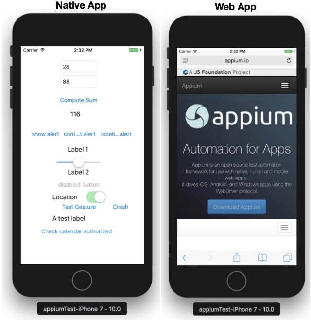

图1  Native App 和 Web App 的 GUI 界面示例

接下来，我将从最初的环境搭建开始，和你来一起开发 iOS 上的 Native App 和 Web App 的测试用例。首先我们看一下 iOS 的环境搭建，如果你之前没有接触过这部分内容，你可以跟着我的步骤一步一步来做；而如果你已经比较熟悉 Xcode 的话，可以跳过这部分内容，直接从“Appium 环境搭建”部分看起。

## iOS 环境搭建

在正式搭建 Appium 环境前，我们先来搭建 iOS 开发环境：
- 首先，下载安装 Xcode；
- 然后，在 Xcode 中下载 iOS 的模拟器；
- 接着，使用 Xcode 编译打包被测试 App；
- 最后，在 iOS 的模拟器中尝试手工执行这两个测试用例。

在 iOS 模拟器中，手动执行测试用例的具体操作步骤如下：
1. 启动 Xcode，导入 ios-test-app 下的 TestApp.xcodeproj 项目。
2. 在 Xcode 中，打开“Preferences”中的“Components”，完成 iOS 10.0 Simulator 的下载。
3. 在 Xcode 的“General”页面，将 TestApp 的“Deployment Target”设置为 10.0，并且将“Devices”设置为“iPhone”，如图 2 所示。

图2 TestApp 的 General 配置

4. 在 Xcode 中编译运行 TestApp，之后系统会自动启动 iPhone 模拟器，自动完成 TestApp 的安装，并在 iPhone 模拟器中自动启动 TestApp。
5. 在 TestApp 中手动执行自定义的加法测试用例。
6. 退出 TestApp，然后打开 Safari 浏览器，在 Safari 中执行访问 Appium 官方主页的测试用例。

至此，你已经搭建好了 iOS 开发环境，并且成功编译打包了 TestApp。接下来，我们再一起来搭建 Appium 测试环境，并尝试在 Appium 中开发上述的两个测试用例。

## Appium 测试环境搭建

通过 Appium 的官方网站下载并安装最新版本的 Appium，截止本文写作的时间，最新版本是 Appium-1.6.2.dmg。

需要注意的是，早期版本和网上很多教程都建议用命令行的形式启动 Appium Server，但在这里我是想强调的是，你完全可以通过界面启动（在 Launchpad 中找到 Appium 的图标，点击即可启动），而且新版本的 Appium 也推荐这个启动方式。通过界面启动，是目前最简单直接的方式。

然后，你需要用命令行“npm install -g appium-doctor”安装 Appium 的环境诊断工具 appium-doctor，用于检查 Appium 所依赖的相关环境变量以及其他安装包是否都已经配置好了。如果还没有，就需要逐个安装，并根据 appium-doctor 的提示配置环境变量。

这里，Appium 最主要的依赖项主要有：Java、Node.js、Xcode、Carthage、Android SDK、adb 等。如果你所有的环境依赖都正常配置的话，你就会看到 appium-doctor 返回这样一个截图，如图 3 所示。

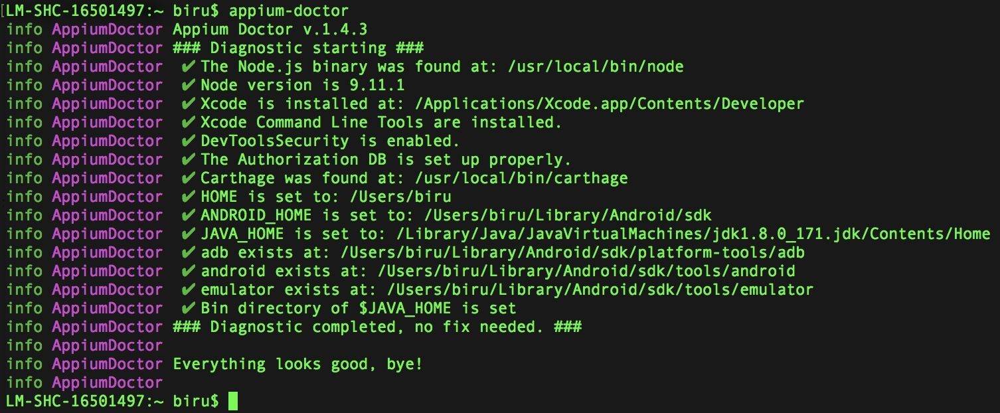

图3 正常配置环境依赖后，appium-doctor 返回的截图

按照上面的步骤，配置好 Appium 的环境依赖后，就可以继续启动 Appium Server 了。

## Appium Inspector 的使用

为了后续测试用例的顺利执行，我们可以先来熟悉一下 Appium Inspector 的使用。Appium Inspector 主要是用来协助对界面元素进行定位的工具。

首先，我们来看看如何使用 Appium Inspector 启动 iPhone 的模拟器，并在模拟器上运行 TestApp，以及如何通过 Inspector 定位 TestApp 界面上的元素（了解元素的定位是后续开发自动化脚本的基础）。具体的操作过程如下。
1. 通过 Appium Server 的“Start Inspector Session”按钮，进入 Session 配置界面。

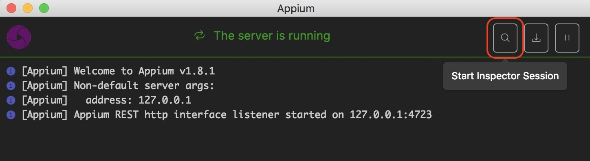

图4 点击“Start Inspector Session”按钮打开 Session 配置界面

2. 在 Session 配置界面完成必要参数的配置。这里你需要根据选用的移动设备操作系统、模拟器 / 真机等具体情况来完成参数配置工作。需要配置的参数主要包括：platformName、platformVersion、DeviceName、automationName 和 app。 
   其中，automationName，指自动化测试框架的名称，这里采用了 XCUITest；app 指被测 Native App 的安装包路径，这里使用之前 Xcode 打包生成的 TestApp.app，这样启动模拟器时，就会自动把 TestApp.app 安装到模拟器中。 
   其他参数的配置非常简单，我就不再一一展开了。

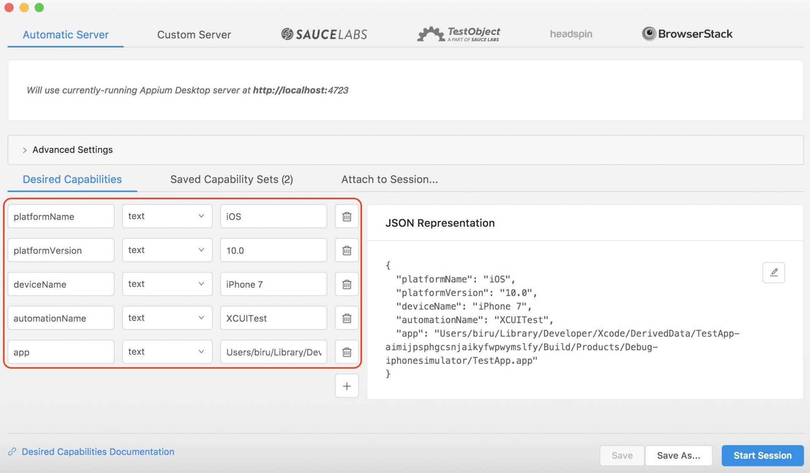

图5 Session 配置界面

3. 完成配置后，点击 Session 界面的“Start Session”按钮，启动 iPhone 模拟器，并在 iPhone 模拟器中启动 TestApp，同时还会打开 Inspector 窗口。如图 6 所示。

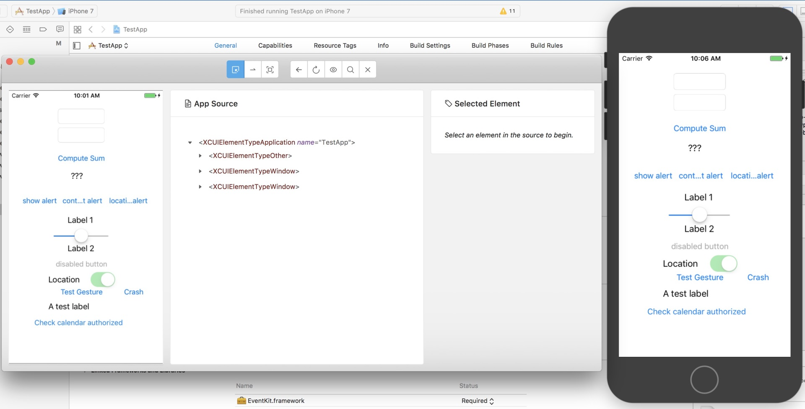

图6启动 Session 后的 Inspector 窗口

4. 在 Inspector 窗口，我们可以利用“Select Elements”功能，通过点击元素显示 Native App 上的元素定位信息。如图 7 所示。

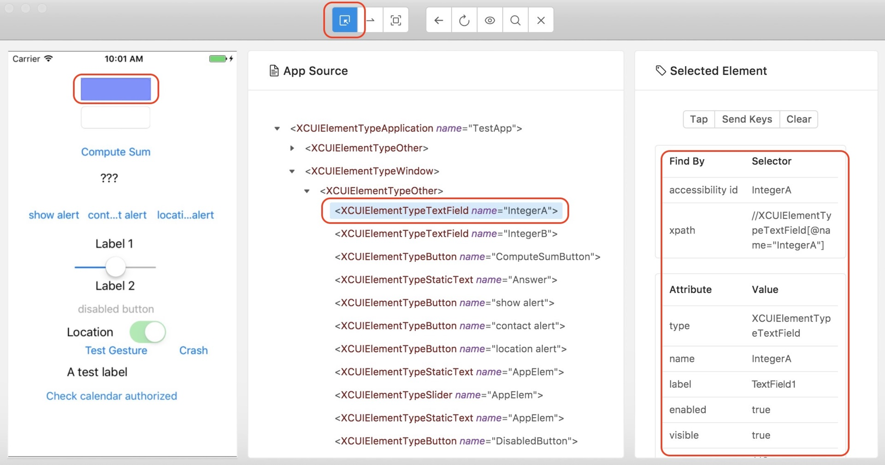

图7 “Select Elements”功能示例

5. 在 Inspector 窗口，可以通过“Recording”功能生成不同语言的自动化脚本。比如在启用了“Recording”功能后，点击“Compute Sum”按钮，就会生成如图 8 所示的自动化脚本片段。

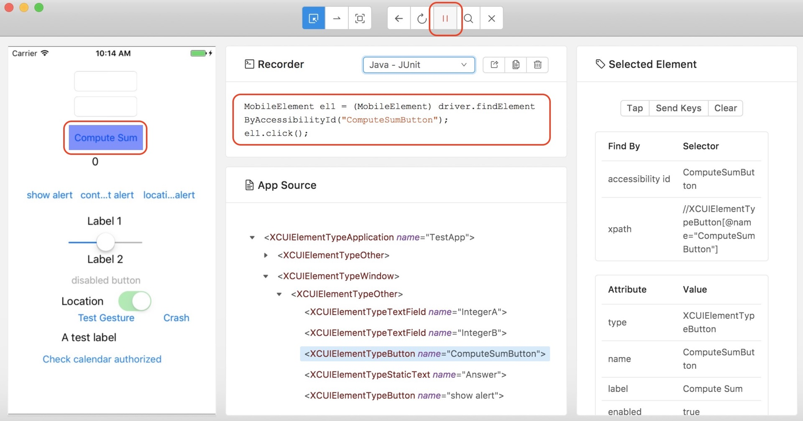
图8 “Recording”功能示例

了解了如何通过 Inspector 获取元素定位信息的方法之后，我们就来正式开发基于 Appium 的第一个 Web App 和第一个 Native App 的测试用例。

## 基于 Appium 开发你的第一个 Native App 的测试用例

<b>第一步，建立一个空的 Maven 项目，然后在 POM 文件中加入如图 9 所示的依赖。</b>

在这个案例里面，我们会使用 TestNG 组织测试用例，所以代码的第 14 行加入了 TestNG 的依赖。

第 19 行的 java-client 是关键，java-client 的作用是利用 Java 代码将测试用例中的操作步骤发送给 Appium Server，然后由 Appium Server 自动完成这些操作。

目前 Appium 支持多种编程语言，每种语言都有自己的 client，比如这里使用 Java 语言，所以引入了 java-client；如果你使用 Python 语言，那么就需要引用 python-client。

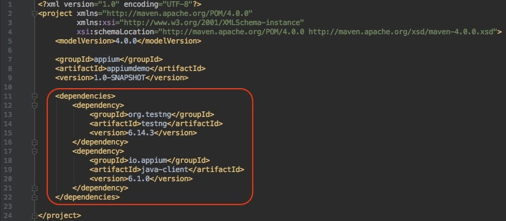

图9 POM 文件加入 TestNG 和 java-client 的依赖

<b>第二步，创建一个类，并命名为“iOS_NativeApp_DemoTest”，然后按照如图 10 所示的代码实现这个 class。</b>

注意，这里的代码是真实的可执行 Java 代码，你可以直接拿去使用。

图10 Native App 测试用例实例

- 代码第 21 行的 @BeforeTest，第 38 行的 @AfterTest，以及第 44 行的 @Test，都是利用了 TestNG 的 annotation 对函数进行标注。 
  标有 @Test 的函数是真正的测试主体，所有测试相关的步骤都放在这个函数中； 
  标有 @ BeforeTest 的函数会在 @Test 函数之前执行测试的相关准备工作，图中的代码用这个函数完成了 DesiredCapabilities 的设置，并用该 Capabilities 构造了 iosdriver； 
  标有 @ AfterTest 的函数在 @Test 函数执行结束后执行，主要用于环境的清理和收尾，图示的代码用这个函数完成了 iosdriver 的退出操作。
- 代码的第 24-33 行构造了 DesiredCapabilities 对象，并对 APPIUM_VERSION、PLATFORM_VERSION、PLATFORM_NAME、AUTOMATION_NAME、DEVICE_NAME 和 APP 等参数进行了设置。其中 APP 的值是被测 Native App 安装包的绝对路径。
- 代码的第 46-58 行是测试用例的主体部分，主要分为三部分： 
- 第 47-50 行通过 iosdriver 的 findElementByAccessibilityId 方法定义了页面上的四个元素，分别是输入参数框 A、输入参数框 B、计算按钮和加法结果显示框。代码中具体的 AccessibilityId 可以通过 Inspector 获取。 
- 第 53-55 行通过自定义元素的操作执行加法运算。 
- 第 58 行通过断言方法 assertEquals 验证加法运算的结果。

<b>第三步，为了运行这个 TestNG 的测试用例，我们需要再添加一个 testng.xml 文件，</b> 具体内容如图 11 所示。

图11 testng.xml 文件示例

<b>第四步，在保证 Appium Server 已经启动的情况下，就可以运行 testng.xml 执行测试了。</b> 测试开始后，首先会自动启动基于 iOS 10.0 的 iPhone 7 模拟器，然后依次自动完成 WebDriverAgent（WDA）和被测 Native App 的安装。

WDA 是由 Facebook 开源的支持 iOS 自动化的代理工具，其底层通过 XCUItest 实现自动化。

接着，就会自动运行被测 Native App，并根据 @Test 函数中定义的步骤完成自动化测试的步骤和验证。

到此，我们的第一个基于 Appium 的 Native App 自动化测试用例就设计完了。

## 基于 Appium 开发你的第一个 Web App 的测试用例

有了 Native App 测试用例的设计基础，再来实现一个基于 Appium 的 Web App 自动化测试用例就简单得多了。

<b>第一步，在上述的 Maven 项目中再创建一个类，并命名为“iOS_WebApp_DemoTest”，然后按照如图 12 所示的代码实现这个类。</b>

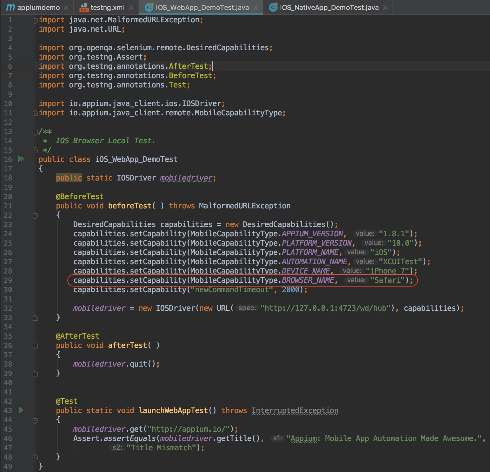

图12 Web App 测试用例实例

代码的整体结构和上述 Native App 测试用例的完全一致，只有一个地方需要特别注意：代码的第 29 行，由于 Web App 是基于浏览器的测试，所以这里不需要指定 App 这个参数，而是直接用 BROWSER_NAME 指定浏览器的名字即可。

对于测试用例的主体部分，也就是代码的第 45-47 行就比较简单了，首先打开 Safari 浏览器并访问“[http://appium.io/](http://appium.io/)”，接着用断言方法 assertEquals 验证页面的 Title 是不是“Appium: Mobile App Automation Made Awesome.”。其中，实际页面的 Title，可以通过 mobiledriver 的 getTitle 方法获得。

<b>第二步，在 testng.xml 中添加这个 Web App 的测试用例，然后我们就可以在 Appium Server 已经启动的情况下执行这个测试用例了。</b>
这个测试用例，首先会自动启动基于 iOS 10.0 的 iPhone 7 模拟器，然后自动打开 Safari 浏览器并访问 Appium 的官方网站。执行完成后的界面如下图 13 所示。

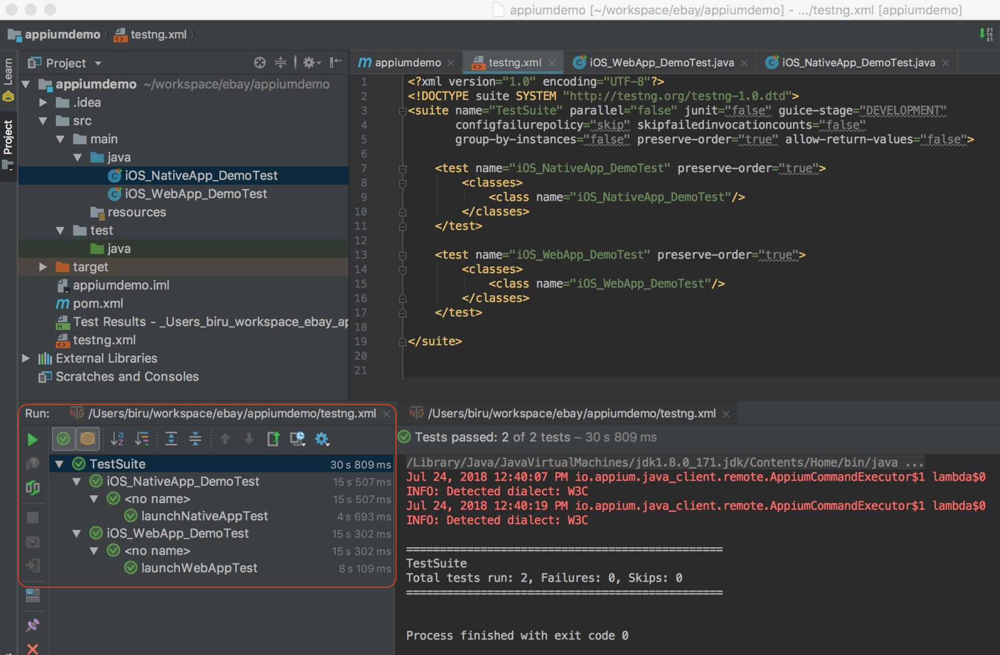

图13测试用例执行完成的界面

进行到这里，我们基于 Appium 开发的第一个 Web App 的自动化测试用例，也就开发完成了。

经过前面 Appium 环境搭建，以及两个测试用例的设计，相信你已经对 Appium 有了一个感性的认识了。那么，Appium 的实现原理又是怎样的呢？理解了 Appium 的使用原理，可以帮助你更好地使用这个工具，设计更加“有的放矢”的测试用例。

## Appium 的实现原理

Appium 作为目前主流的移动应用自动化测试框架，具有极强的灵活性，主要体现在以下 5 个方面：
- 测试用例的实现支持多种编程语言，比如 Java、Ruby、Python 等；
- Appium Server 支持多平台，既有基于 Mac 的版本，也有基于 Windows 的版本；
- 支持 Web App、Native App 和 Hybird App 三大类移动应用的测试；
- 既支持 iOS，也支持 Android；
- 既支持真机，也支持模拟器。

实际应用中，你可以根据项目情况灵活组合完成移动应用的自动化测试。比如，用 Java 写 iOS 上的 Native App 的测试用例，测试用例跑在 Mac 平台的 iPhone 虚拟机上；或者，用 Python 写 Android 上的 Web App 的测试用例，测试用例通过 Windows 平台跑在 Android 的真机上。

这样的组合还有很多很多。那你有没有想过，Appium 为什么可以做到如此强大的灵活性呢？这就要从 Appium 的基本原理讲起了。

要真正理解 Appium 的内部原理，你可以把 Appium 分成三大部分，分别是 Appium Client、Appium Server 和设备端。这三部分的关系如图 14 所示。

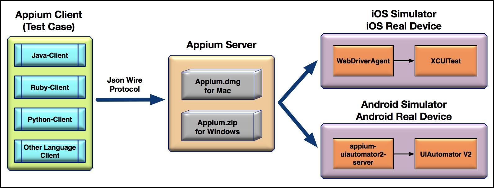

图14 Appium 内部原理

<b>我们先来看看处于中间位置的 Appium Server。</b>

Appium Server 有 Mac 和 Windows 版本，也就是说 Appium Server 可以运行在 Mac 或者 Windows 电脑上。本质上，Appium Server 是一个 Node.js 应用，接受来自 Appium Client 的请求，解析后通过 WebDriver 协议和设备端上的代理打交道。
- 如果是 iOS，Appium Server 会把操作请求发送给 WebDriverAgent（简称 WDA），然后 WDA 再基于 XCUITest 完成 iOS 模拟器或者真机上的自动化操作；
- 如果是 Android，Appium Server 会把操作请求发送给 appium-UIautomator2-server，然后 appium-UIautomator2-server 再基于 UIAutomator V2 完成 Android 模拟器或者真机上的自动化操作。

Appium Client 其实就是测试代码，使用对应语言的 Client 将基于 JSON Wire 协议的操作指令发给 Appium Server。

整体来说，Appium 的内部原理可以总结为：<b>Appium 属于 C/S 架构，Appium Client 通过多语言支持的第三方库向 Appium Server 发起请求，基于 Node.js 的 Appium Server 会接受 Appium Client 发来的请求，接着和 iOS 或者 Android 平台上的代理工具打交道，代理工具在运行过程中不断接收请求，并根据 WebDriver 协议解析出要执行的操作，最后调用 iOS 或者 Android 平台上的原生测试框架完成测试。</b>

## 总结

好了，我来总结一下今天的主要的内容：

目前网络上，Appium 工具使用相关的资料都比较零散，为此我以最新版本的 Appium Desktop 1.6.2 和 Appium Server 1.8.1 为例，手把手地带你搭建了 iOS 环境，以及 Appium 测试环境，并介绍了如何通过 Appium Inspector 来定位页面元素。

搭建好了测试环境后，我分别针对 Native App 和 Web App 这两类移动应用，基于 Appium 实现了两个测试用例，这也是我在这个专栏里面，为你实现的第一个移动应用的测试用例。虽然测试需求比较简单，但是你也可以从中体会到移动应用测试用例设计的思想、方法。

最后，本着知其然知其所以然的原则，我介绍了 Appium 的实现原理：它属于 C/S 架构，Appium Client 通过第三方库向 Appium Server 发起请求，Appium Server 接受请求，然后和移动平台上的代理工具打交道，代理工具在运行过程中不断接收来自 Appium Server 的请求，并解析出要执行的操作，最后调用移动平台原生的测试框架完成测试操作。

## 思考题

我在这篇文章里面举的例子都是基于 iOS 的，建议你基于 Android 分别实现一个 Web App 和 Native App 的测试用例。