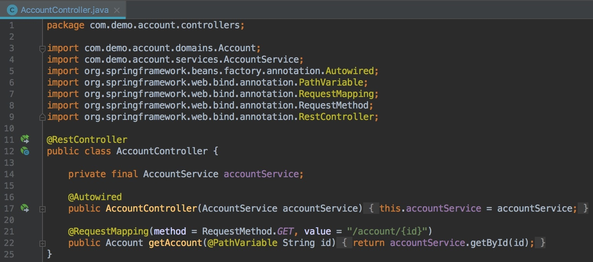
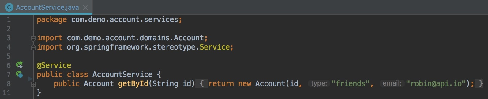
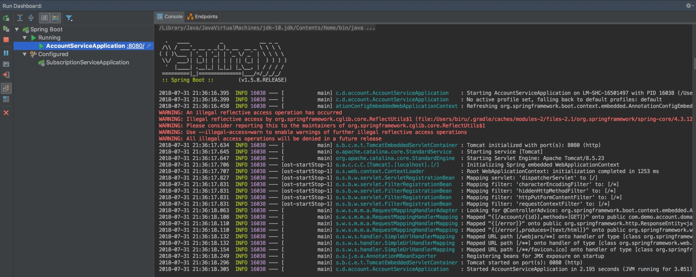
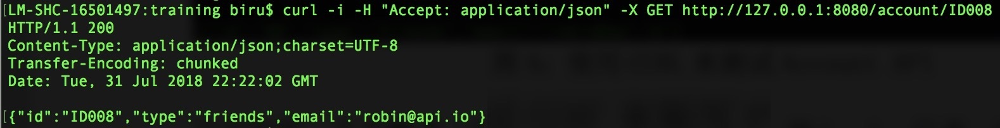
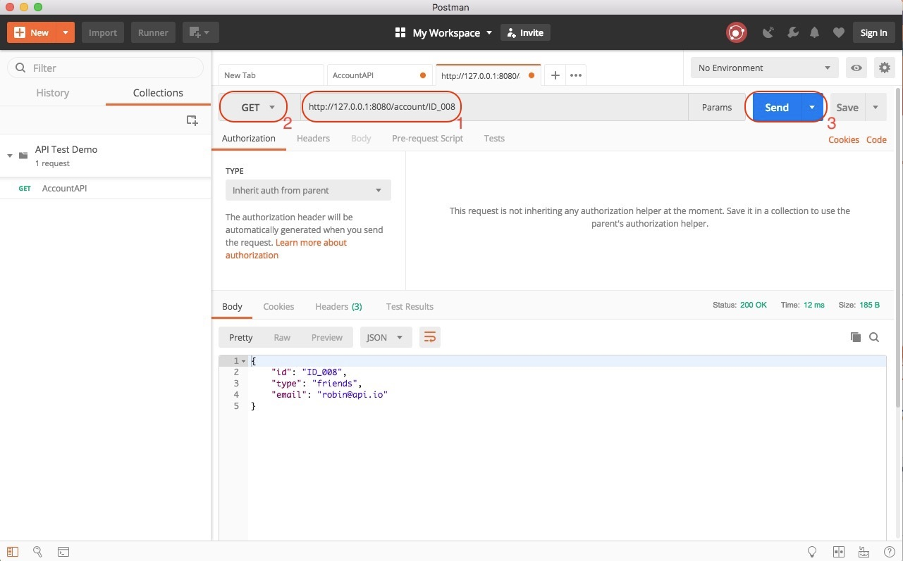
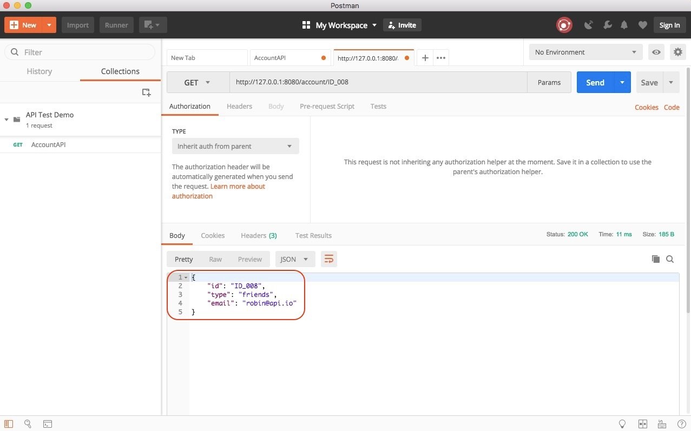
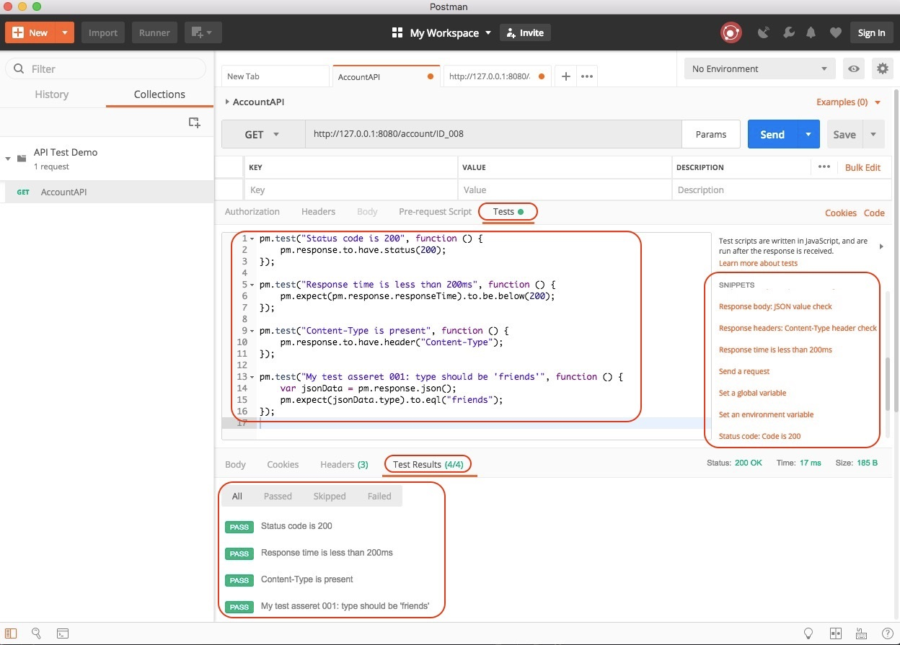
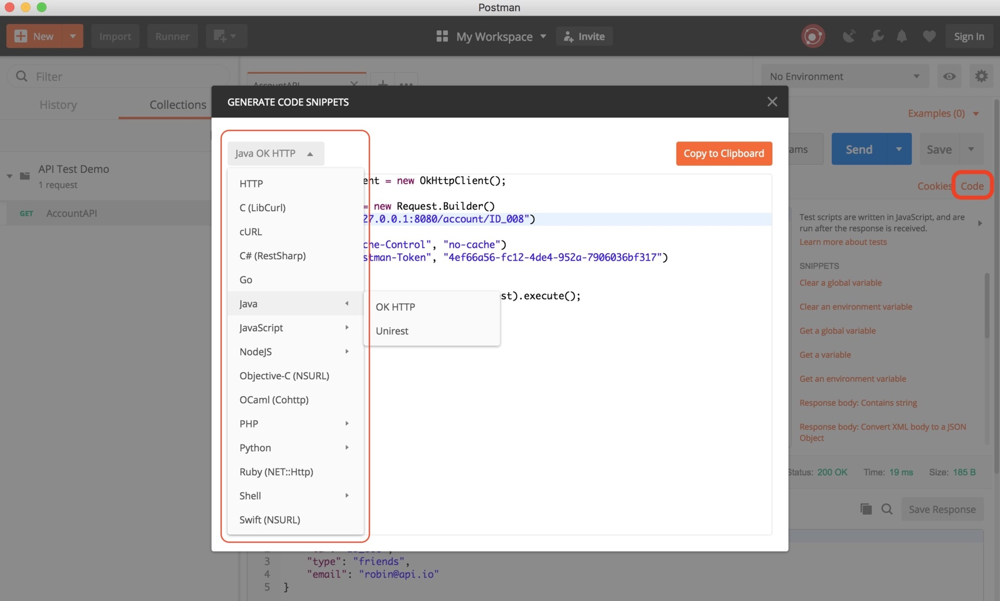

# 从0到1：API测试怎么做？常用API测试工具简介

在第 11 篇文章[《互联网产品的测试策略应该如何设计？》](011.md)中，我介绍过当今互联网产品的测试策略往往会采用菱形结构，即重量级 API 测试，轻量级 GUI 测试，轻量级单元测试，由此可见 API 测试在现今测试中的重要性不言而喻。

这篇文章是 API 自动化测试系列的第一篇文章，我会先为你打好 API 测试的基础。所以，我会先从 0 到 1 设计一个 API 测试用例，通过这个测试用例，你可以体会到最基本的 API 测试是如何进行的，并介绍几款常用的 API 测试工具。

## API 测试的基本步骤

通常来讲，无论采用什么 API 测试工具，API 测试的基本步骤主要包括以下三大步骤：
1. 准备测试数据（这是可选步骤，不一定所有 API 测试都需要这一步）；
2. 通过 API 测试工具，发起对被测 API 的 request；
3. 验证返回结果的 response。

对 API 的测试往往是使用 API 测试工具，比如常见的命令行工具 cURL、图形界面工具 Postman 或者 SoapUI、API 性能测试的 JMeter 等。

为了让你更好地理解 API 测试具体是怎么做的，并掌握常见 API 测试工具的使用，我会以基于主流 Spring Boot 框架开发的简单 Restful API 为例，分别介绍如何使用 cURL 和 Postman 对其进行最基本的功能测试，目的是让你对 API 测试有一个基本的感性认识。<!-- [[[read_end]]] -->

## 基于 Spring Boot 构建的 API

因为基于 Spring Boot 从 0 到 1 构建一个 API，并不是本文的重点，为了不影响你对文章主要内容的把握，我直接采用了一个预先开发好的 Account API 为例展开讲解。你可以从[https://github.com/SpectoLabs/spring-cloud-contract-blog](https://github.com/SpectoLabs/spring-cloud-contract-blog)下载完整的代码。

这个 Account API 的功能非常简单，就是基于你提供的 ID 值创建一个 Account 对象，并返回这个新创建 Account 对象。

比如，如果你的请求是“account/ID008”，那么返回的 response 就应该是“{“id”:“ID008”,“type”:“friends”,“email”:“robin@api.io”}”。

这个 Account API 的功能逻辑实现非常简单，图 1 和图 2 列出了主要的代码逻辑。

图 1 中，代码的第 21 行说明了 API 的 endpoint 以及对应的操作是 GET 方法，第 22 行明确说明了 GET 方法具体的业务逻辑是由 accountService.getById() 方法实现的。



图 1  RestController 的实现

图 2 中，代码的第 8 行实现了 accountService.getById() 方法，具体逻辑就是返回一个以传入 ID 为 ID 的 Account 对象。



图 2  具体业务逻辑的实现

我推荐使用 IntelliJ 打开这个下载的项目，然后直接启动其中的 account-service。启动成功后，account-service 会运行在本地机器的 8080 端口。启动成功后的界面如图 3 所示。



图 3 成功启动基于 Spring Boot 的 Account API

## 使用 cURL 命令行工具进行测试

首先，你需要下载安装 cURL，然后就可以通过以下命令发起 Account API 的调用。调用结束后的界面如图 4 所示。

```
curl -i -H "Accept: application/json" -X GET "http://127.0.0.1:8080/account/ID008"
```



图 4  使用 cURL 测试 Account API

这行命令中参数的含义如下：
- 第一个参数“-i”，说明需要显示 response 的 header 信息；
- 第二个参数“-H”，用于设定 request 中的 header；
- 第三个参数“-X”，用于指定执行的方法，这里使用了 GET 方法，其他常见的方法还有 POST、PUT 和 DELETE 等，如果不指定“-X”，那么默认的方法就是 GET。
- 最后“ <a href="http://127.0.0.1:8080/account/ID008">http://127.0.0.1:8080/account/ID008</a> ”，指明了被测 API 的 endpoint 以及具体的 ID 值是“ID008”。

当使用 cURL 进行 API 测试时，常用参数还有两个：
- “-d”：用于设定 http 参数，http 参数可以直接加在 URL 的 query string，也可以用“-d”带入参数。参数之间可以用“&amp;”串接，或使用多个“-d”。
- “-b”：当需要传递 cookie 时，用于指定 cookie 文件的路径。

需要注意的是这些参数都是大小写敏感的。

了解了这几个最常用的参数后，我再来分析一些最常用的 cURL 命令以及使用的场景，包括 Session 的场景和 Cookie 的场景。

### 第一，Session 的场景

如果后端工程师使用 session 记录使用者登入信息，那么后端通常会传一个 session ID 给前端。之后，前端在发给后端的 requests 的 header 中就需要设置此 session ID，后端便会以此 session ID 识别出前端是属于具体哪个 session，此时 cURL 的命令行如下所示：

```
curl -i -H "sessionid:XXXXXXXXXX" -X GET "http://XXX/api/demoAPI"
```

### 第二，Cookie 的场景

如果是使用 cookie，在认证成功后，后端会返回 cookie 给前端，前端可以把该 cookie 保存成为文件，当需要再次使用该 cookie 时，再用“-b cookie_File” 的方式在 request 中植入 cookie 即可正常使用。具体的 cURL 的命令行如下所示：

```
// 将 cookie 保存为文件
curl -i -X POST -d username=robin -d password=password123 -c ~/cookie.txt "http://XXX/auth"

// 载入 cookie 到 request 中
curl -i -H "Accept:application/json" -X GET -b ~/cookie.txt "http://XXX/api/demoAPI"
```

最后，需要特别说明的是，cURL 只能发起 API 调用，而其本身并不具备结果验证能力（结果验证由人完成），所以严格意义上说 cURL 并不属于测试工具的范畴。但是由于 cURL 足够轻量级，经常被很多开发人员和测试人员使用，所以我在这里做了简单的介绍。

接下来，我们再来看看如何使用目前主流的 Postman 完成 API 测试。

##  使用图形界面工具 Postman 进行测试

Postman 是目前使用最广泛的 Http 请求模拟工具之一，常常被用于 Web Service API 的测试。

早期的 Postman，是以 Chrome 浏览器的插件（plugin）形式存在的，最新版本的 Postman 已经是独立的应用了。我猜想是因为这个工具的应用日益广泛，所以才有了今天的独立版本。

你可以通过[官方网站](http://www.getpostman.com)下载对应于 Mac、Windows 和 Linux 操作系统的不同版本，截止文章写作完成时，最新的 Mac 版本是 6.2.2。

接下来，我就会以 Mac 6.2.2 版本为例，跟你分享如何用 Postman 完成你的 API 测试。如果你使用浏览器的 plugin 版本，或者是基于其他操作系统的版本，这都没问题，基本的操作和步骤都是一样的。

具体的操作，主要包括：
1. 发起 API 调用；
2. 添加结果验证；
3. 保存测试用例；
4. 基于 Postman 的测试代码自动生成。

### 第一步，发起 API 调用

我们的目标是对 Account API 做测试，所以这里你需要选择 Postmant 的“Request”模块。进入相应界面后，你需要按照图 5 的提示依次执行以下三步操作，发起 Account API 的调用。
1. 在 endpoint 输入框中输入“[http://127.0.0.1:8080/account/ID_008](http://127.0.0.1:8080/account/ID_008)”；
2. 选择“GET”方法；
3. 点击“Send”按钮发起 API 调用。




图 5 Postman 发起 Account API 的测试

完成以上步骤后，界面如图 6 所示。我们看到返回的 response 默认以 JSON 文件的形式显示在下面的 Body 中。



图 6  Postman 执行 GET 后的界面

这样就完成了一次 Account API 的调用，是不是非常简单。但问题是，这只是一个 API 调用，并没有对调用结果进行自动化验证。接下来，我们就加上结果验证的部分，一起看看会有什么效果。

### 第二步，添加结果验证

在 Postman 中添加结果验证也非常方便，假定我们在 Account API 测试过程中有以下四个验证点：
1. 请求的返回状态码（Status Code）应该是 200；
2. 请求的响应时间应该小于 200  ms；
3. 请求返回的 response header 中应该包含“Content-Type”参数；
4. 请求返回的 response body 中，“type”的值应该是“friends”；


那么，接下来我们一起来看看如何使用 Postman 来添加这四个验证点。

为此，我们首先打开“Tests”界面，然后在右下角的“SNIPPETS”中依次点击：
1. “Status code: Code is 200”
2. “Response time is less than 200  ms”
3. “Response headers：Content-Type header check”
4. “Response body: JSON value check”


完成以上操作后，“Tests”中会自动生成验证代码，接着只要按照具体的测试要求，对这些生成的代码进行一些小修改就可以了。
在这个例子中，你只需修改需要验证的 JSON 键值对即可，即代码的第 15 行。修改完成后我们可以再次点击“Send”按钮发起测试。测试通过的界面如图 7 所示，最下面的“Test Results”显示四个测试全部通过。



图 7  测试通过的界面

### 第三步，保存测试用例

测试通过后，我们往往希望可以把这个测试 request 保存下来，以方便后续使用，为此 Postman 提供了保存测试 request 的功能，并提供了 Collection 来分类管理保存多个测试 request。

Collection 是用来保存测试 request 的一个集合，Collection 内部还可以建立目录结构以方便进一步的分类和管理。

这里我们点击“Save As”按钮，在弹出的对话框中可以建立 Collection，并且可以命名测试 request 并将其保存到 Collection 中。

我建立了“API Test Demo”的 Collection，并且将刚才的测试 request 命名为“AccountAPI”保存到这个 Collection 中。

以后再要使用这个测试 request 时，直接在 Collection 中打开它，即可使用。同时你如果申请注册了一个 Postman 账号，就可以很方便地在多个环境中共享这个 Collection 了。

### 第四步，基于 Postman 的测试代码自动生成

至此，你已经掌握了 Postman 最基本的使用方法，但还有一个问题没有解决。很多时候，你希望将你的测试 request 作为回归测试用例集成到 CI/CD 的流程中，这就要求可以通过命令行的方式执行你的测试。为了达到这个目的，目前有两种做法：
1. <b>将 Postman 中的测试 request 用自动化的方式直接转换成 API 测试的代码。</b> 目前 Postman 已经支持这个功能了，可以将保存的测试 request 自动化转换成常见测试框架直接支持的代码，而且支持多语言。<br>
比如，基于 Java 的“OK HTTP”和“Unirest”，基于 Python 的“http.client”和“Requests”，基于 NodeJS 的“Native”“Request”和“Unirest”，基于 JavaScript 的“JQuery AJAX”和“XHR”等等。你可以点击如图 8 所示的“Code”按钮进入代码生成界面。



图 8  自动生成 API 测试代码

2. <b>利用 Newman 工具直接执行 Postman 的 Collection。</b> 你需要先将 Postman 中的 Collection 导出为 JSON 文件，然后执行以下命令行。

```
newman run examples/sample-collection.json;
```

## 如何应对复杂场景的 API 测试？

我在前面分享的 Restful API 测试案例中，只涉及到了最基本的 API 的测试方法，而且测试场景也很比较简单（只是单个 API 的调用）。

但在实际项目中，除了这种单个 API 的测试场景外，还有很多复杂场景的 API 测试。所以，为了解决你在实际项目中可能会碰到的一些问题，我再和你聊聊目前一些常见的典型复杂场景，以及相应的测试思路和方法。

### 测试场景一：被测业务操作是由多个 API 调用协作完成

很多情况下，一个单一的前端操作可能会触发后端一系列的 API 调用，由于前端测试的相对不稳定性，或者由于性能测试的要求，你必须直接从后端通过模拟 API 的顺序调用来模拟测试过程。

这时，API 的测试用例就不再是简单的单个 API 调用了，而是一系列 API 的调用，并且经常存在后一个 API 需要使用前一个 API 返回结果的情况，以及需要根据前一个 API 的返回结果决定后面应该调用哪个 API 的情况。

好在，<b>我们已经实现了 API 的调用和结果解析的代码化，这也就意味着我们可以很灵活地直接用代码来处理这些场景了。</b> 比如，通过代码将上个 API 调用返回的 response 中的某个值传递给下一个 API，再比如根据上一个 API 的返回结果决定下一个应该调用哪个 API 等。

除此之外，<b>我们还需要迫切解决的一个问题是：如何才能高效地获取单个前端操作所触发的 API 调用序列。</b>

解决这个问题的核心思路是，通过网络监控的手段，捕获单个前端操作所触发的 API 调用序列。比如，通过类似于 Fiddler 之类的网络抓包工具，获取这个调用序列；又比如，目前很多互联网公司还在考虑基于用户行为日志，通过大数据手段来获取这个序列。

### 测试场景二：API 测试过程中的第三方依赖

API 之间是存在依赖关系的，比如你的被测对象是 API A，但是 API A 的内部调用了 API B，此时如果由于某种原因，API B 在被测环境中处于不可用状态，那么 API A 的测试就会受到影响。

在单体架构下，通常只会在涉及到第三方 API 集成的场景中才会遇到这个问题，所以还不算严重。但是，在微服务架构下，API 间相互耦合的依赖问题就会非常严重。

解决这个问题的核心思路是，启用 Mock Server 来代替真实的 API。那么，Mock Server 怎么才能真实有效地模拟被替代的 API 呢？这个问题，我会在分享《紧跟时代步伐：微服务模式下 API 测试要怎么做？》这个主题时，和你详细探讨。

### 测试场景三：异步 API 的测试

异步 API 是指，调用后会立即返回，但是实际任务并没有真正完成，而是需要稍后去查询或者回调（Callback）的 API。

一直以来，异步 API 测试都是 API 测试中比较困难的部分。<b>在我看来，对异步 API 的测试主要分为两个部分：一是，测试异步调用是否成功，二是，测试异步调用的业务逻辑处理是否正确。</b>
- 异步调用是否成功，这个还比较简单，主要检查返回值和后台工作线程是否被创建两个方面就可以了。
- 但是，对异步调用业务逻辑的测试就比较复杂了，因为异步 API 通常发生在一些比较慢的操作上，比如数据库 I/O、消息队列 I/O 等，此时测试往往需要去验证数据库中的值、消息队列中的值等，这就需要测试代码具有访问和操作数据库或者消息队列的能力。<br>
  在实际工程项目中，这些能力一般会在测试框架级别提供，也就是说要求 API 测试框架中包含对应的工具类去访问和操作数据库或者消息队列等。

## 总结

通常情况下，无论你采用什么 API 测试工具，基本的测试步骤往往都是三步，即准备测试数据（并不是所有的 API 测试都需要这一步）、通过 API 测试工具发起对被测 API 的 request、验证返回结果的 response。

接下来，我通过一个简单的 Restful API 测试为例，和你分享了 cURL 和 Postman 这两个常用 API 测试工具的使用。

其中，cURL 只具备发起 API 调用的功能，而不具备结果验证能力，所以严格地说它并不属于测试工具的范畴。Postman 常常被用于 Web Service API 的测试具体的操作，测试流程主要包括：发起 API 调用、添加结果验证、保存测试用例、基于 Postman 的测试代码自动生成。

最后，为了帮你应对实际工程项目中复杂的 API 测试场景，我分享了被测业务操作是由多个 API 调用协作完成、API 测试过程中的第三方依赖、异步 API 的测试，这三个复杂场景下的测试思路和方法。

## 思考题

单个 API 测试是比较简单的，但在实际项目中，往往存在按时序的 API 调用以及异步 API 调用，这类 API 你是如何测试的？遇到过什么难题，又是如何解决的？