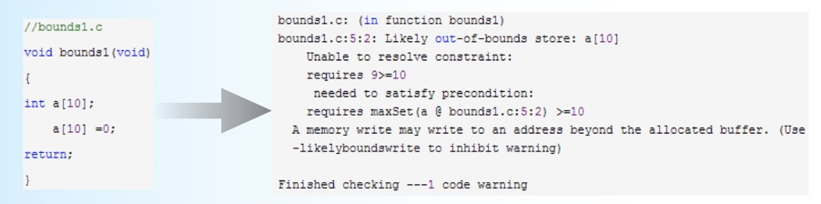
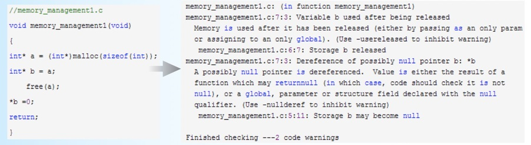
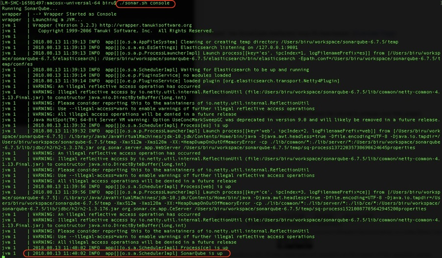
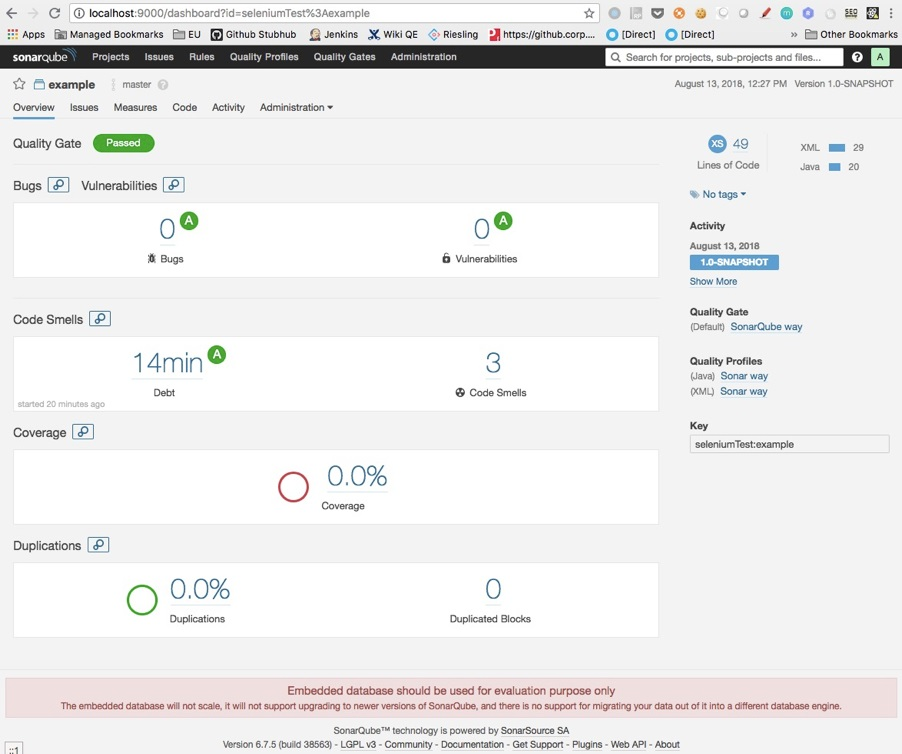
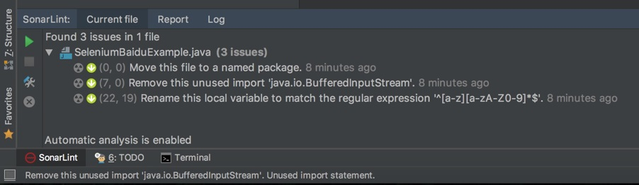
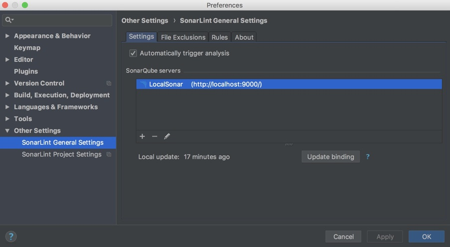

# 深入浅出之静态测试方法

我在分享[《不破不立：掌握代码级测试的基本理念与方法》](025.md)这个主题时，系统地介绍了代码级测试常见的五种错误类型（包括语法特征错误、边界行为特征错误、经验特征错误、算法错误，以及部分算法错误），以及对应的四大类测试方法（包括人工静态方法、自动静态方法、人工动态方法，以及自动动态方法）。

今天，我将和你详细讨论人工静态测试方法和自动静态测试方法，来<b>帮你理解研发流程上是如何保证代码质量的，以及如何搭建自己的自动静态代码扫描方案，并且应用到项目的日常开发工作中去。</b>

人工静态方法本质上属于流程上的实践，实际能够发现问题的数量很大程度依赖于个人的能力，所以从技术上来讲这部分内容可以讨论的点并不多。但是，这种方法已经在目前的企业级测试项目中被广泛地应用了，所以我们还是需要理解这其中的流程，才能更好地参与到人工静态测试中。

而自动静态方法，可以通过自动化的手段，以很低的成本发现并报告各种潜在的代码质量问题，目前已经被很多企业和项目广泛采用，并且已经集成到 CI/CD 流水线了。作为测试工程师，我们需要完成代码静态扫描环境的搭建。接下来我会重点和你分享这一部分内容。

## 人工静态方法

通过我上一次的分析，我们知道了人工静态方法检查代码错误，主要有代码走查、结对编程，以及同行评审这三种手段。那么我们接下来就看一下这三种方法是如何执行的。
- <b>代码走查（Code Review）</b>，是由开发人员检查自己的代码，尽可能多地发现各类潜在错误。但是，由于个人能力的差异，以及开发人员的“思维惯性”，很多错误并不能在这个阶段被及时发现。
- <b>结对编程（Pair Programming）</b>，是一种敏捷软件开发的方法，一般是由两个开发人员结成对子在一台计算机上共同完成开发任务。其中，一个开发人员实现代码，通过被称为“驾驶员”；另一个开发人员审查输入的每一行代码，通常被称为“观察员”。<br>
  当“观察员”对代码有任何疑问时，会立即要求“驾驶员”给出解释。解释过程中，“驾驶员”会意识到问题所在，进而修正代码设计和实现。<br>
  实际执行过程中，这两个开发人员的角色会定期更换。
- <b>同行评审（Peer Review）</b>，是指把代码递交到代码仓库，或者合并代码分支（Branch）到主干（Master）前，需要和你同技术级别或者更高技术级别的一个或多个同事对你的代码进行评审，只有通过所有评审后，你的代码才会被真正递交。<br>
如果你所在的项目使用 GitHub 管理代码，并采用 GitFlow 的分支管理策略，那么在递交代码或者分支合并时，需要先递交 Pull Request（PR），只有这个 PR 经过了所有评审者的审核，才能被合并。这也是同行评审的具体实践。目前，只要你采用 GitFlow 的分支管理策略，基本都会采用这个方式。

对于以上三种方式，<b>使用最普遍的是同行评审</b>。因为同行评审既能较好地保证代码质量，又不需要过多的人工成本投入，而且递交的代码出现问题后责任明确，另外代码的可追溯性也很好。

结对编程的实际效果虽然不错，但是对人员的利用率比较低，通常被用于一些非常关键和底层算法的代码实现。

## 自动静态方法

自动静态方法，主要有以下三个特点：

相比于编译器，可以做到对代码更加严格、个性化的检查；
不真正检测代码的逻辑功能，只是站在代码本身的视角，基于规则，尽可能多地去发现代码错误；
由于静态分析算法并不实际执行代码，完全是基于代码的词法分析、语法分析、控制流分析等技术，由于分析技术的局限性以及代码写法的多样性，所以会存在一定的误报率。

基于这些特点，自动静态方法通常能够以极低的成本发现以下问题：
- 使用未初始化的变量；
- 变量在使用前未定义；
- 变量声明了但未使用；
- 变量类型不匹配；
- 部分的内存泄漏问题；
- 空指针引用；
- 缓冲区溢出；
- 数组越界；
- 不可达的僵尸代码；
- 过高的代码复杂度；
- 死循环；
- 大量的重复代码块；
- …

正是由于自动静态方法具有自动化程度高，检查发现问题的成本低以及能够发现的代码问题广等特点，所以该方法被很多企业和项目广泛应用于前期代码质量控制和代码质量度量。

<b>在实际工程实践中，企业往往会结合自己的编码规范定制规程库，并与本地 IDE 开发环境和持续集成的流水线进行高度整合。</b>

代码本地开发阶段，IDE 环境就可以自动对代码实现自动静态检查；当代码递交到代码仓库后，CI/CD 流水线也会自动触发代码静态检查，如果检测到潜在错误，就会自动邮件通知代码递交者。

接下来，我们一起来看两个自动静态方法发现错误的实际案例，希望可以加深你对自动静态方法的认识。

## 自动静态方法的实际例子

<b>第一个例子，自动静态方法检查语法特征错误。</b>

如图 1 左侧所示的 C 语言代码，存在数组越界的问题，一种典型的语法特征错误。

图 1 右侧，就是通过 C 语言的自动静态扫描工具 splint 发现的这个问题，并给出的分析结果。



图 1 数组越界的错误

<b>第二个例子，自动静态方法检查内存空间被释放后继续被赋值的错误。</b>

如图 2 左侧所示的 C 语言代码，我们用 malloc 函数申请了一个内存空间，并用指针 a 指向了这个空间，然后新建了一个指针 b 也指向这个空间，也就是指针 a 和指针 b 实际上指向了同一个内存空间。之后，我们把指针 a 指向的空间释放掉了，意味着指针 b 指向的空间也被释放了。但是，此时代码却试图去对指针 b 指向的空间赋值，显然这会导致不可预料的后果。

幸运的是，C 语言的自动静态扫描工具 splint 发现了这个问题，并给出了详细解释。



图 2 内存空间释放后还继续使用的错误

## 实际案例：Sonar 实战

现在，我们已经了解了自动静态代码扫描的基本概念，那怎么把这些知识落地到你的实际项目中呢？我们就从目前主流的自动静态工具 Sonar 的使用开始吧。

考虑到你可能以前并没有接触过 Sonar，所以我会按照 step by step 的节奏展开。如果你已经用过 Sonar 了，你可以跳过在 Mac 电脑上建立 Sonar 的步骤，从完成你的 Maven 项目的自动静态分析开始。

通过这个 Sonar 实例，你可以掌握：
- 搭建自己的 SonarQube 服务器；
- 扫描 Maven 项目，并将结果报告递交到 SonarQube 服务器；
- 在 IntelliJ IDE 中集成 SonarLint 插件，在 IDE 中实现实时的自动静态分析；

首先，在[Sonar 官网](https://www.sonarqube.org/downloads/)下载 LTS（Long-term Support）版本的 SonarQube 6.7.5。这里需要注意的是，我不推荐在实际工程项目中使用最新版的 SonarQube，而是建议使用 LTS 版本以保证稳定性和兼容性。

解压后运行其中的 bin/macosx-universal-64 目录下的 sonar.sh，这里需要注意运行 sonar.sh 时要带上“console”参数。如果执行完成的界面如下图 3 所示，那么说明你的 SonarQube 服务已经成功启动。



图 3 SonarQube 启动成功的界面

此时，你可以尝试访问 localhost:9000，并用默认账号（用户名和密码都是“admin”）登录。

为了简化建立 SonarQube 的步骤，所有的内容我都使用了默认值。比如，我直接使用了 SonarQube 内建的数据库，端口也采用了默认的 9000。但是，在实际工程项目中，为了 Sonar 数据的长期可维护和升级，我们通常会使用自己的数据库，需要执行下面这些步骤：
1. 安装 SonarQube 之前，先安装数据库；
2. 建立一个空数据库并赋予 CRUD 权限；
3. 修改 SonarQube 的 conf/sonar.properties 中的 JDBC 配置，使其指向我们新建的数据库。我们也可以采用同样的方法，来修改默认的端口。

因为要在 Maven 项目中执行代码静态扫描，为此我们需要先找到 $MAVEN_HOME/conf 下的 settings.xml 文件，在文件中加入 Sonar 相关的全局配置，具体需要加入的内容如下所示：


```xml
<settings>
    <pluginGroups>
        <pluginGroup>org.sonarsource.scanner.maven</pluginGroup>
    </pluginGroups>
    <profiles>
        <profile>
            <id>sonar</id>
            <activation>
                <activeByDefault>true</activeByDefault>
            </activation>
            <properties>
                <sonar.host.url>
                  http://myserver:9000
                </sonar.host.url>
            </properties>
        </profile>
     </profiles>
</settings>
```

最后，我们就可以在 Maven 项目中，执行“mvn clean verify sonar:sonar”命令完成静态代码扫描。

如果你是第一次使用这个命令，那么 mvn 会自动下载依赖 maven-sonar-plugin，完成后发起代码的静态扫描，并会自动把扫描结果显示到 SonarQube 中。

图 4 所示的结果，就是我对[《从 0 到 1：你的第一个 GUI 自动化测试》](012.md)一文中的 GUI 测试项目代码的扫描结果。



图 4 SonarQube 的静态扫描结果页面

扫描结果是 Passd，但同时也发现了三个 Code Smell 问题，或者说是改进建议，如图 5 所示。
1. Class 建议放在 package 中；
2. 导入了 java.io.BufferedInputStream，但没有在实际代码中使用，建议删除；
3. 建议变量名字不要包含下划线。


图 5 详细扫描结果示例

至此，你已经使用 Sonar 完成了一次代码的静态扫描，是不是还挺方便的？

但是，在日常工作中你可能还想要实时看到 Sonar 分析的结果，这样可以大幅提高修改代码的效率。为此，我们可以在 IDE 中引入 SonarLint 插件。你可以通过 IDE 的 plugin（插件）管理界面安装 SonarLint。

安装完成后重启 IDE，你就可以在 IDE 环境中实时看到 Sonar 的静态分析结果了，如图 6 所示。



图 6 在 IDE 中直接查看静态扫描结果

另外，在 IDE 中绑定 SonarQube，就可以把 SonarLint 和 SonarQube 集成在一起了，如图 7 所示。集成完成后，IDE 本地的代码扫描就能使用 SonarQube 端的静态代码规则库了，在企业级的项目中，一般要求所有开发人员都使用统一的静态代码规则库，所以一般都会要求本地 IDE 的 SonarLint 与 SonarQube 集成。



图 7 IDE 中的 SonarLint 和 SonarQube 绑定

目前，自动静态扫描通常都会和持续集成的流水线做绑定，最常见的应用场景是当你递交代码后，持续集成流水线就会自动触发自动静态扫描，这一功能是通过 Jenkins 以及 Jenkins 上的 SonarQube 插件来完成的，当你在 Jenkins 中安装了 SonarQube Plugin，并且将 SonarQube 服务器相关的配置信息加入 Plugin 之后，你就可以在 Jenkins Job 的配置中增加 Sonar 静态扫描步骤了。

## 总结

人工静态方法，主要有代码走查、结对编程和同行评审三种常用方法。在工程实践中，同行评审因为可以保证代码质量、效率高、责任明确等特点，已经被广泛采用。

自动静态方法，因为自动化程度高、成本低、发现的代码问题广等特点，是常用的代码级测试方法。

在这里，测试工程师需要完成代码静态扫描环境的搭建，考虑到你以前可能没有接触过 Sonar，我按照 step by step 的思路，带你一起搭建了一套代码静态扫描环境，并分享了一个 Maven 项目代码静态扫描的实例。

这就是我今天分享的主要内容了，希望可以帮助你解决实际工作中遇到的问题。

## 思考题

除了 Sonar，你还用过哪些静态代码扫描工具，使用过程中遇到过哪些问题？