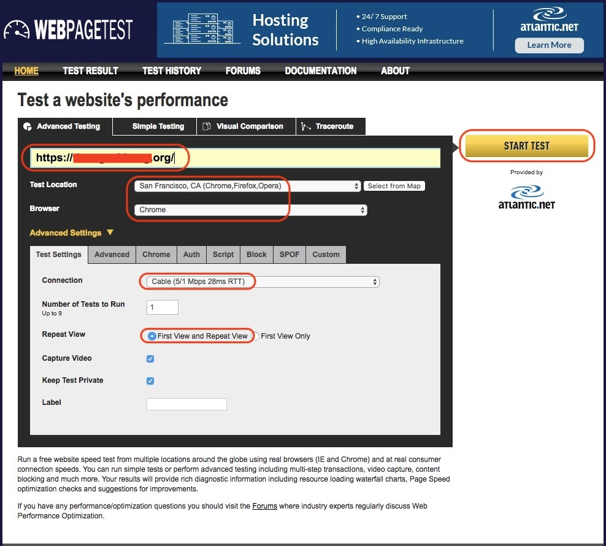
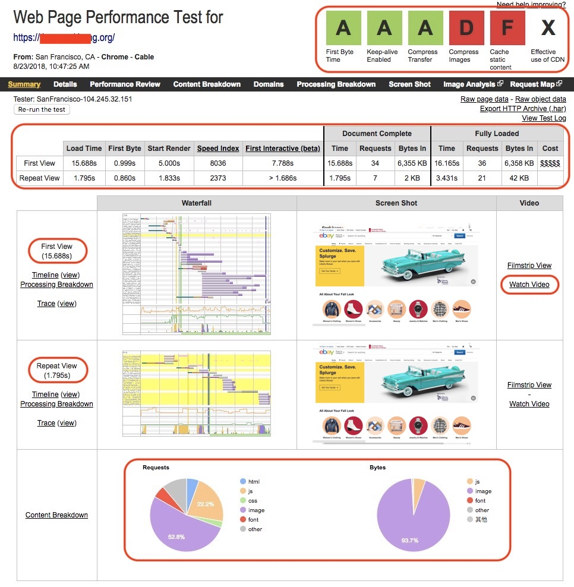
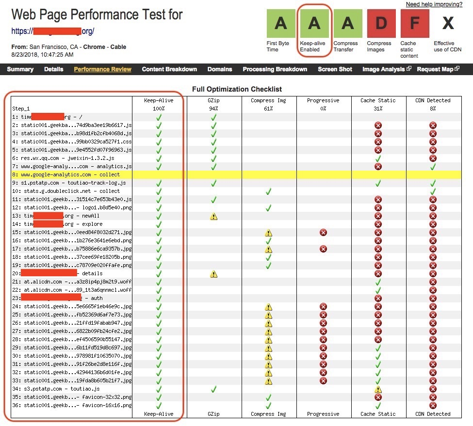
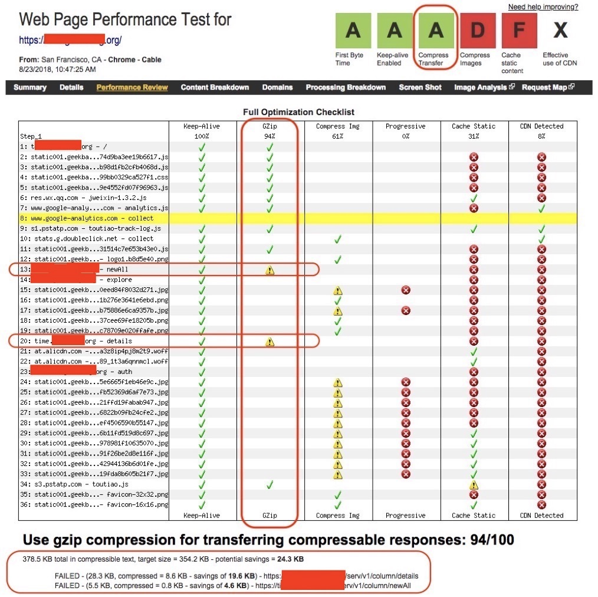
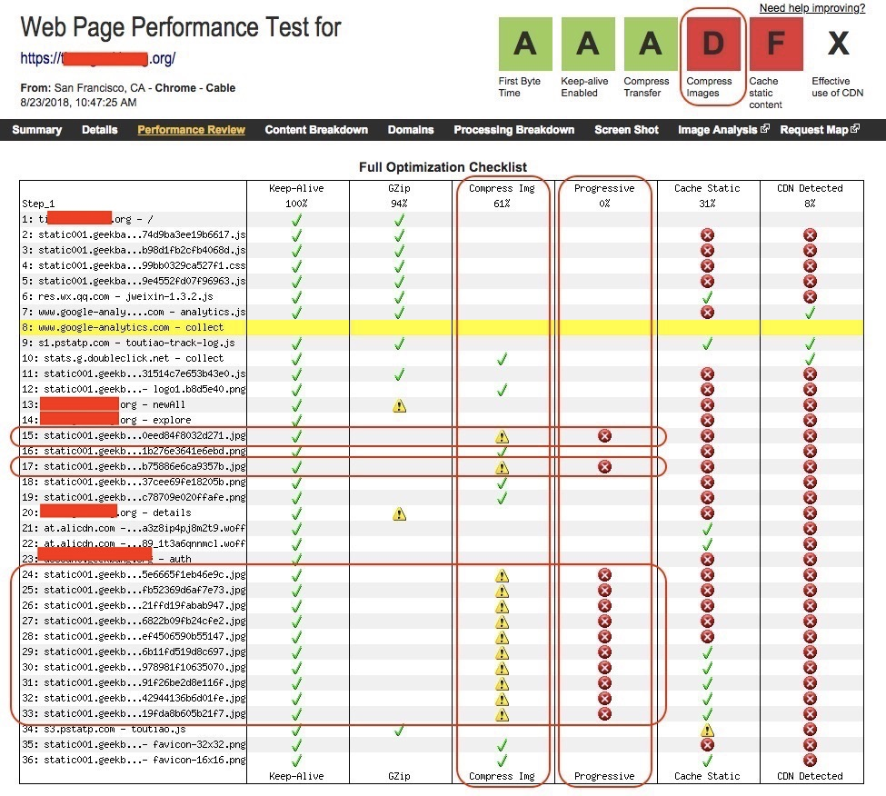
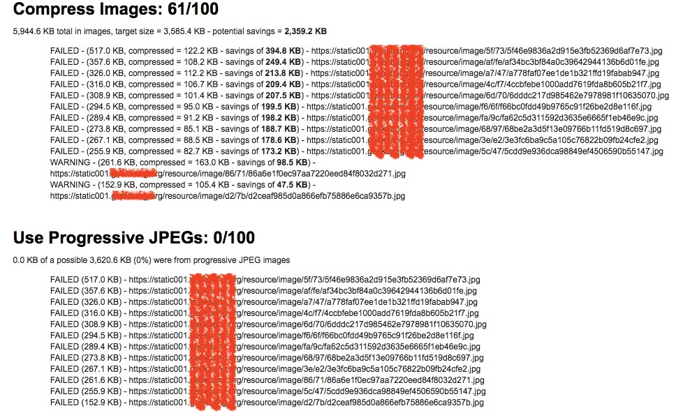
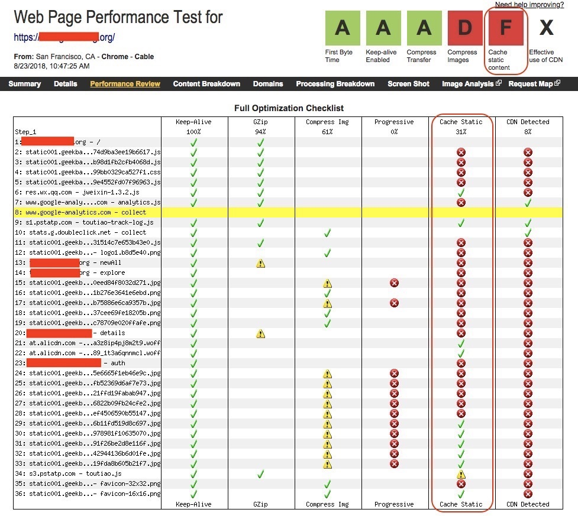
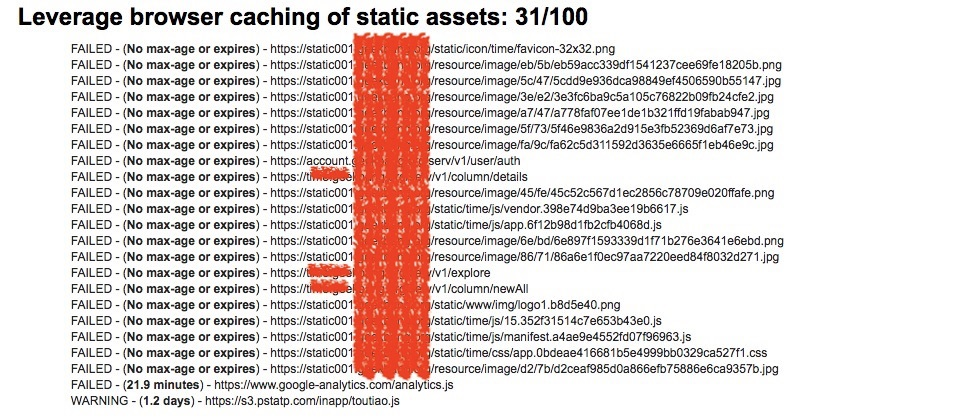
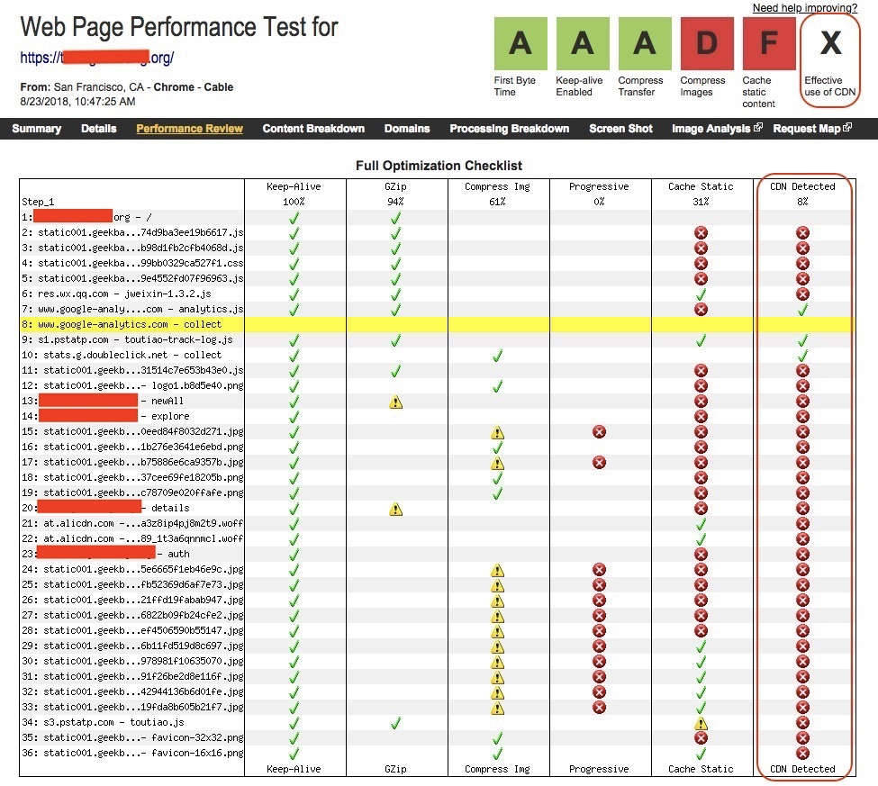
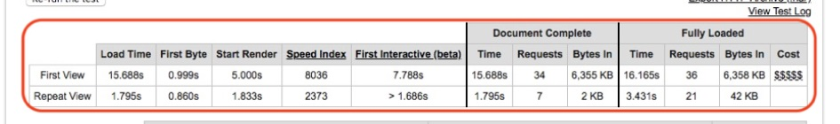

# 工欲善其事必先利其器：前端性能测试工具原理与行业常用工具简介

不同于后端性能测试知识的琐碎、独立，今天我将从问答形式回到正常的分享思路上，为你介绍前端性能测试工具为。我会以一个具体网站为例，和你分析 WebPagetest 的用法，以及前端性能相关的主要概念与指标。

# WebPagetest 功能简介

WebPagetest，是前端性能测试的利器：
- 可以为我们提供全方位的量化指标，包括页面的加载时间、首字节时间、渲染开始时间、最早页面可交互时间、页面中各种资源的字节数、后端请求数量等一系列数据；
- 还可以自动给出被测页面性能优化水平的评价指标，告诉我们哪些部分的性能已经做过优化处理了，哪些部分还需要改进；
- 同时，还能提供 Filmstrip 视图、Waterfall 视图、Connection 视图、Request 详情视图和页面加载视频慢动作。

可以说，WebPagetest 为我们提供了前端页面性能测试所需要的一切，而且还是免费的。接下来，我们就通过测试一个具体的网站，实践一下它的强大功能，以及具体使用方法吧。

# 使用 WebPagetest 测试某网站的首页

那么，接下来我就以某网站首页的前端性能测试和评估为例，和你一起看看如何使用这个强大的前端性能工具。<!-- [[[read_end]]] -->

<b>首先，访问 WebPagetest 的主页“[http://www.webpagetest.org/”](http://www.webpagetest.org/) ，也就是工具的使用界面。</b>
1. 将被测页面的地址填写到被测 Website URL 栏中；
2. 选择测试发起的地域（Test Location）以及你希望使用的浏览器，这里我选择了美国旧金山、Chrome 浏览器。

WebPagetest 在全球各大洲的很多国家和地区都有自己的测试代理机，这些测试代理机可能是虚拟机，也可能是真机，还有很多是建立在 Amazon EC2 上的云端机器。另外，WebPagetest 除了支持各种浏览器以外，还支持主流的 Android 设备和 Apple 设备。

<b>然后，选择需要模拟的网络情况</b>。这里我选择了有线网络 Cable，当然你也可以根据你的测试要求选择各种 3G 或者 4G 移动网络。

<b>接着，在 Repeat View 中选择“First View and Repeat View”</b>。这是一个很关键的选项。我们知道当使用浏览器访问网站时，第一次打开一个新的网页往往会很慢，而第二次打开通常就会快很多，这是因为浏览器端会缓存很多资源。这个选项的意思就是既要测试第一次打开页面的前端性能（First View），也要测试在有缓存情况下重复打开的前端性能（Repeat View）。

<b>最后，点击“Start Test”发起测试</b>。最终的测试设置界面，如图 1 所示。由于全球所有的用户会共享这些散布在各地的测试代理机，所以发起测试后，一般情况下我们的测试并不会被立即执行，而是会进入排队系统。当然，WebPagetest 界面会清楚地告诉你排在第几位。

图 1 WebPagetest 的测试执行界面

测试执行完成后，我们会看到如图 2 所示的测试结果页面。这个页面包含非常多的信息，接下来我会一一解读这些信息，同时跟你分享前端性能指标相关的概念。

图 2 WebPagetest 的测试结果页面

# 前端性能评估结果评分

图 2 右上角的性能评估结果栏，列出了主要性能评估项目的评分。可以看到“First Byte Time”“Keep-alive Enabled”和“Compress Transfer”三项的评分都是 A 级，说明这三项做得比较好。但是，“Compress Images”“Cache static content”和“Effective use of CDN”的评分比较差，是需要优化的部分。

那么，接下来我们就看看这六项前端性能指标分别代表什么涵义。

<b>第一，First Byte Time</b>

First Byte Time，指的是用户发起页面请求到接收到服务器返回的第一个字节所花费的时间。这个指标反映了后端服务器处理请求、构建页面，并且通过网络返回所花费的时间。

本次测试的结果，首次打开页面（First View）花费的时间是 999 ms，重复打开页面（Repeat View）花费的时间是 860 ms。这两个指标都在 1 s 以下，所以 WebPagetest 给出了 A 级的评分。

<b>第二，Keep-alive Enabled</b>

页面上的各种资源（比如，图片、JavaScript、CSS 等）都需要通过链接 Web 服务器来一一获取，与服务器建立新链接的过程往往比较耗费时间，所以理想的做法是尽可能重用已经建立好的链接，而避免每次使用都去创建新的链接。

Keep-alive Enabled 就是，要求每次请求使用已经建立好的链接。它属于服务器上的配置，不需要对页面本身进行任何更改，启用了 Keep-alive 通常可以将加载页面的时间减少 40%~50％，页面的请求数越多，能够节省的时间就越多。

如图 3 所示，本次测试的结果显示，所有的请求都复用了同一个链接，所以 WebPagetest 也给出了 A 级的评分。

图 3 Keep-alive Enabled 的统计结果

<b>第三，Compress Transfer</b>

如果将页面上的各种文本类的资源，比如 Html、JavaScript、CSS 等，进行压缩传输，将会减少网络传输的数据量，同时由于 JavaScript 和 CSS 都是页面上最先被加载的部分，所以减小这部分的数据量会加快页面的加载速度，同时也能缩短 First Byte Time。

为文本资源启用压缩通常也是服务器配置更改，无需对页面本身进行任何更改。

如图 4 所示，本次测试结果显示，这个网站绝大多数的文本类资源都通过 GZip 进行了压缩，所以 WebPagetest 也给出了 A 级的评分。但是第 13 和第 20 项的两个资源并没有被压缩，报告中显示如果这两个资源也经过压缩，将可以减少额外的 24.3KB 的数据传输量。

图 4 Compress Transfer 的统计结果

<b>第四，Compress Images</b>

为了减少需要网络传输的数据量，图像文件也需要进行压缩处理。显然本次测试结果显示（图 5），所有的 JPEG 格式图片都没有经过必要的压缩处理，并且所有的 JPEG 格式图片都没有使用渐进式 JPEG（Progressive JPEG）技术，所以 WebPagetest 给出了 D 级的评分。

如果你不是专门做前端的工程师，可能并不知道什么是渐进式 JPEG，没关系，我来简单解释一下吧。

普通 JPEG 文件存储方式是按从上到下的扫描方式，把每一行顺序地保存在 JPEG 文件中。打开这个文件显示它的内容时，数据将按照存储时的顺序从上到下一行一行地被显示，直到所有的数据都被读完，就完成了整张图片的显示。

如果文件较大或者网络下载速度较慢，就会看到图片是被一行一行加载的。为了更好的用户体验，渐进式 JPEG 技术就出现了。

渐进式 JPEG 包含多次扫描，然后将扫描顺序存储在 JPEG 文件中。打开文件的过程，会先显示整个图片的模糊轮廓，随着扫描次数的增加，图片会变得越来越清晰。这种格式的主要优点是在网络较慢时，通过图片轮廓就可以知道正在加载的图片大概是什么。

所以，这种技术往往被一些网站用于打开较大图片。

图 5 Compress Images 的统计结果

<b>第五，Cache Static Content</b>

一般情况下，页面上的静态资源不会经常变化，所以如果你的浏览器可以缓存这些资源，那么当重复访问这些页面时，就可以从缓存中直接使用已有的副本，而不需要每次向 Web 服务器请求资源。这种做法，可以显著提高重复访问页面的性能，并减少 Web 服务器的负载。

如图 6 所示，本次测试结果显示，被测网站有超过一半的静态资源没有被浏览器缓存，每次都需要从 Web 服务器端获取，所以 WebPagetest 给出了 F 级的评分。

图 6 Cache Static Content 的统计结果

<b>第六，Effective use of CDN</b>

首先，我来解释一下什么是 CDN。

CDN 是内容分发网络的缩写，其基本原理是采用各种缓存服务器，将这些缓存服务器分布到用户访问相对集中的地区的网络供应商机房内，当用户访问网站时，利用全局负载技术将用户的访问指向距离最近的、工作正常的缓存服务器上，由缓存服务器直接响应用户请求。

理解了什么是 CDN 后，我们再一起来看一下本次测试中 CDN 的使用情况。如图 7 所示，显然本次被测网站绝大多数的资源并没使用 CDN。也许是由于本次发起测试的机器是在美国旧金山，而旧金山可能并不是该网站的目标市场，所以它并没有在这里的 CDN 上部署资源。

图 7 CDN 使用的统计结果

# 其他前端性能指标解读

图 8 WebPagetest 测试显示的前端性能指标

现在，我们再回过头来看看如图 8 所示的表格，这个表格包含了很多的前端性能指标，大多数指标，我们可以从字面上很容易理解其含义，比如 Load Time、First Byte、Requests 等，我就不再赘述了。

但是，Start Render、First Interactive 和 Speed Index 这三个指标，相对较难理解，所以我会简单为你解释一下。

<b>第一，Start Render</b>

Start Render，指的是浏览器开始渲染的时间，从用户角度看就是在页面上看到第一个内容的时间。该时间决定了用户对页面加载快慢的的第一直观印象，这个时间越短用户会感觉页面速度越快，这样用户也会有耐心去等待其他内容的展现。如果这个时间过长，则用户会在长时间内面对一个空白页面后，失去耐心。

理论上讲，Start Render 时间主要由三部分组成，分别是“发起请求到服务器返回第一个字节的时间（也就是 First Byte 时间）”“从服务器加载 HTML 文档的时间”，以及“HTML 文档头部解析完成所需要的时间”，因此<b>影响 Start Render 时间的因素就包括服务器响应时间、网络传输时间、HTML 文档的大小以及 HTML 头中的资源使用情况。</b>

本次测试中，第一次打开网页的 Start Render 时间是 5 s，而第二次打开网页的 Start  Render 时间是 1.83 s。理想的 Start Render 时间并没有严格的标准，一般来情况下，这个值最好不要大于 3 s，所以这个网站还可以再优化一下这个指标。

优化的基本思路是先找出时间到底花在了哪里，由于第二次的结果还是比较理想，所以可以从首次资源加载的角度找出突破口。

<b>第二，First Interactive</b>

First Interactive，可以简单地理解为最早的页面可交互时间。页面中可交互的内容，包括很多种类，比如点击一个链接、点击一个按钮都属于页面可交互的范畴。First Interactive 时间的长短对用户体验的影响十分重要，决定着用户对页面功能的使用，这个值越短越好。

为了使这个值尽可能得小，我们通常会采取以下措施：
- 只有页面控件内容渲染出来了，才有可能进行交互，所以 First Interactive 依赖于 Start Render 时间。
- 尽量将交互控件的代码放置在 HTML BODY 的前部，让其尽早加载。
- 尽早做 JavaScript 的初始化和绑定，目前大多数做法有两种，一是在 DOM Ready 中做所有 JavaScript 的初始化和功能绑定，二是在页面底部做 JavaScript 的初始化和功能绑定。

这两种方式的优点在于简单，不需要关注具体 DOM 结点的位置；缺点则在于初始化的时间太晚。因此，<b>应该将 JavaScript 的初始化提前到相关 DOM 元素建立起来后进行，例如将初始化的操作直接放在元素之后进行，这样就可以使控件尽可能早地变成可交互状态。</b>

本次测试中，第一次打开网页的 First Interactive 时间是 7.788 s，而第二次打开网页的 First Interactive 时间是略大于 1.686 s 的某个值。理想的 First Interactive 时间也没有严格的标准，一般情况下，这个值最好不要大于 5 s，所以这个网站还可以根据上面的三条措施再优化一下这个指标。

<b>第三，Speed Index</b>

严格来说，Speed Index 是通过微积分定义的。我们理解起来会比较困难，所以在这里我们和你只做定性的讨论。

通常，影响网页性能体验的一个重要指标是页面打开时间。打开时间越短，其体验越好。但是，当存在两个打开时间完全相同的网站 A 和 B 时，其中网站 A 的打开过程是逐渐渲染页面完成的，而网站 B 的打开过程则是空白了一段时间后在短时间内完成页面渲染完成的。

毫无疑问，网站 A 的用户体验一定好于 B。Speed Index 就是用来衡量这种体验的，通常来讲，它的值越小越好。

本次测试中，第一次打开网页的 Speed Index 是 8036，而第二次打开网页的 Speed Index 是 2373。

# WebPagetest 实际使用中需要解决的问题

讨论到这里，你是不是觉得 WebPagetest 是一个很强大的免费工具，但是如果想要在实际工程项目中全面推行该工具的话，还需要解决两个问题。

<b>第一个问题是，如果被测网站部署在公司内部的网络中，那么处于外网的 WebPagetest 就无法访问这个网站，也就无法完成测试</b>。要解决这个问题，你需要在公司内网中搭建自己的私有 WebPagetest 以及相关的测试发起机。具体如何搭建，你可以参考<a href="https://github.com/WPO-Foundation/webpagetest-docs/blob/master/user/Private%20Instances/README.md">WebPagetest 官网的建议</a>，这里我就不再继续展开了。

<b>第二个问题是，用 WebPagetest 执行前端测试时，所有的操作都是基于界面操作的，不利于与 CI/CD 的流水线集成</b>。要解决这个问题，就必须引入 WebPagetest API  Wrapper。

WebPagetest API Wrapper 是一款基于 Node.js，调用了 WebPagetest 提供的 API 的命令行工具。也就是说，你可以利用这个命令行工具发起基于 WebPagetest 的前端性能测试，这样就可以很方便地与 CI/CD 流水线集成了。具体的使用步骤如下：
1. 通过“npm install webpagetest -g”安装该命令行工具；
2. 访问 https://www.webpagetest.org/getkey.php 获取你的 WebPagetest API Key；
3. 使用“webpagetest test -k API-KEY 被测页面 URL”发起测试，该调用是异步操作，会立即返回，并为你提供一个 testId；
4. 使用“webpagetest status testId”查询测试是否完成；
5. 测试完成后，就可以通过“webpagetest results testId”查看测试报告，但是你会发现测试报告是个很大的 JSON 文件，可读性较差；
6. 通过“npm install webpagetest-mapper -g”安装 webpagetest-mapper 工具，这是为了解决测试报告可读性差的问题，将 WebPagetest 生成的 JSON 文件格式的测试报告转换成为 HTML 文件格式；
7. 使用“Wptmap -key API-KEY --resultIds testId --output ./test.html”将 JSON 文件格式的测试结果转换成 HTML 格式。

# 总结

今天，我使用 WebPagetest 测试了一个具体网站的前端性能。在解读这个测试报告的同时，我和你分享了几个重要的前端性能指标，以及如何提升这些指标，最终达到优化网站用户体验的目的。

虽然，WebPagetest 是一款免费的、功能强大的前端性能测试工具，但是用于实际测试项目时，往往还存在两个方面的问题，我给你分析了这两个问题出现的原因，以及如何解决这两个问题，以达到更高效地完成前端性能测试的目的。

# 思考题

除了我今天介绍的 WebPagetest 外，前端测试工具还有 YSlow 等。你还在工作中接触过哪些前端性能测试工具，它们各自有什么特点呢？