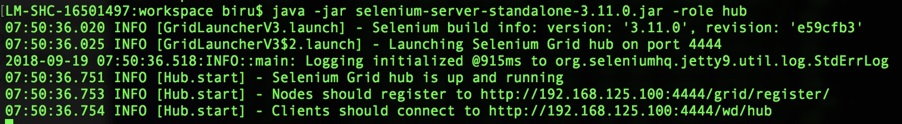
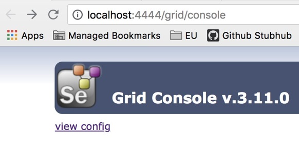
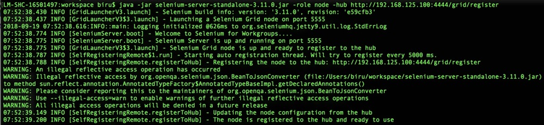
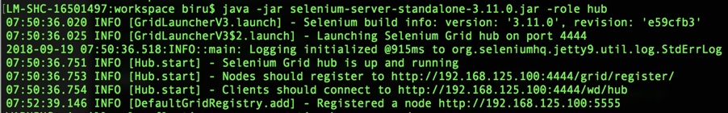
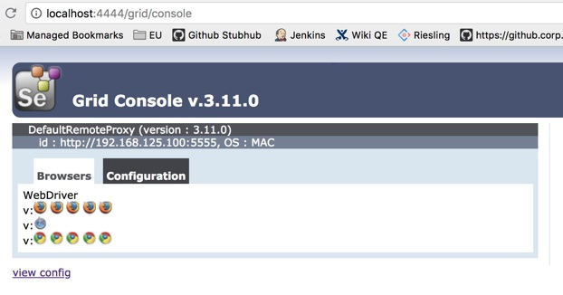

# 从小作坊到工厂：什么是Selenium Grid？如何搭建Selenium Grid？

从今天开始，我们就要一起进入测试基础架构这个新的系列了。我将用四篇文章的篇幅，从 0 到 1，为你深入剖析大型互联网企业的测试基础架构设计，以及其原始驱动力，和你探讨测试执行环境设计、测试报告平台设计以及测试基础架构与 CI/CD 的集成等内容。当然，在这其中还会涉及到很多具有前瞻性的设计创新。

虽说测试基础架构是资深测试开发人员的必备技能，但此时你可能还并不清楚测试基础架构到底指的是什么？没关系，当你阅读完这个系列的文章之后，相信你一定可以对测试基础架构，以及其关键设计有一个清晰、全面的认识。

所以，今天我就先和你分享一下，我眼中的测试基础架构到底是指什么？

## 什么是测试基础架构？

测试基础架构指的是，执行测试的过程中用到的所有基础硬件设施以及相关的软件设施。因此，我们也把测试基础架构称之为广义的测试执行环境。通常来讲，测试基础架构主要包括以下内容：
- 执行测试的机器；
- 测试用例代码仓库；
- 发起测试执行的 Jenkins Job；
- 统一的测试执行平台；
- 测试用例执行过程中依赖的测试服务，比如提供测试数据的统一测试数据平台、提供测试全局配置的配置服务、生成测试报告的服务等；
- …

<b>由于测试基础架构的核心是围绕测试执行展开的，所以我们今天就先来重点讨论一下“执行测试的机器”部分。</b>

这部分内容的展开，我会从早期最简单的方法谈起，然后探讨这个方法在实际执行中的弊端，并由此引出我们今天讨论的主角：Selenium Grid。

先试想一下：你要在一个典型测试场景中，基于某种浏览器去执行 Web 应用的 GUI 测试。这时，你首先要做的就是找到相应的机器，并确保上面已经安装了所需的浏览器。如果这台机器上，还没有安装所需浏览器的话，你需要先安装这个浏览器。一切准备就绪后，你就可以使用这台机器执行测试了。

如果你要执行的测试只需要覆盖一种浏览器的话，那就很简单了，你只要事先准备好一批专门的机器或者虚拟机，然后安装好所需的浏览器就可以了。同时，如果测试用例的数量也不是很多的话，你需要的这批机器或者虚拟机的数量也不会很多。执行测试时，你只要将需要使用的那台机器的地址提供给测试用例就可以了。

其实，这种模式就是典型的“小作坊”模式。“小作坊”模式的特点就是，人工维护一批数量不多（通常在 30 台以内）的执行测试的机器，然后按需使用。

对于小团队来讲，“小作坊”模式的问题并不大。但是，随着测试覆盖率要求的提升，以及测试用例数量的增加，这种“小作坊”模式的弊端就逐渐显现，并被不断放大了。其中，最主要问题体现在以下四个方面：
1. 当 Web 应用需要进行不同浏览器的兼容性测试时，首先你需要准备很多台机器或者虚拟机，并安装所需的不同浏览器；然后，你要为这些机器建立一个列表，用于记录各台机器安装了什么浏览器；最后，你在执行测试时，需要先查看机器列表以选择合适的测试执行机。
2. 当 Web 应用需要进行同一浏览器的不同版本的兼容性测试时，你同样需要准备很多安装有同一浏览器的不同版本的测试执行机，并为这些机器建立列表，记录各台机器安装的浏览器版本号，然后执行测试时先查看列表以选择合适的测试执行机。
3. 测试执行机的机器名或者 IP 发生变化，以及需要新增或者减少测试机时，都需要人工维护这些机器列表。很显然，这种维护方式效率低下，且容易出错。
4. 在 GUI 自动化测试用例的数量比较多的情况下，你不希望只用一台测试执行机以串行的方式执行测试用例，而是希望可以用上所有可用的测试执行机，以并发的方式执行测试用例，以加快测试速度。为了达到这个目的，你还是需要人工管理这些测试用例和测试执行机的对应关系。

<b>这四种情况的问题，可以归结为：测试执行机与测试用例的关系是不透明的，即每个测试用例都需要人为设置测试执行机。</b>

为了改善这种局面，Selenium Grid 就应运而生了。
- 一方面，使用 Selenium Grid 可以让测试机器的选择变得“透明”。也就是说，我们只要在执行测试用例时指定需要的浏览器版本即可，而无需关心如何找到合适的测试执行机。因为，这寻找符合要求的测试执行机的工作，Selenium Grid 可以帮你完成。
- 另一方面，Selenium Grid 的架构特点，天生就能很好地支持测试用例的并发执行。

接下来，我就和你详细聊聊到底什么是 Selenium Grid，Selenium Grid 的架构是什么样的。

图 1 Selenium Grid 的架构

从本质上讲，Selenium Grid 是一种可以并发执行 GUI 测试用例的测试执行机的集群环境，采用的是 HUB 和 Node 模式。这个概念有些晦涩难懂，我来举个例子吧。

假如，现在有个律师事务所要接受外来业务，那么就会有一个老大专门负责对外接受任务。收到任务后，这个老大会根据任务的具体要求找到合适的手下，然后将该任务分发给手下去执行。

那么，这个老大是怎么知道哪个手下最适合处理这个任务呢？其实，这个老大手下的每个人都会事先报备自己具备的技能，这样老大在分发任务的时候，就可以做到“有的放矢”了。

现在，我们再回到 Selenium Grid。Selenium Grid 由两部分构成，一部分是 Selenium Hub，另一部分是 Selenium Node。

将这个律师事务所的例子，与 Selenium Grid 做个类比，它们的对应关系是：
- 这个对外的老大对应的是 Selenium Hub；
- 具体执行任务的手下，对应的是 Selenium Node；
- 老大接到任务后分配给手下执行的过程，就是 Selenium Hub 将测试分配到 Selenium Node 执行的过程；
- 老大的手下向他报备自己技能的过程，就是 Selenium Node 向 Selenium Hub 注册的过程。

也就是说，<b>Selenium Hub 用来管理各个 Selenium Node 的注册信息和状态信息，并且接收远程客户端代码的测试调用请求，并把请求命令转发给符合要求的 Selenium Node 执行。</b>

现在，我们已经搞明白了什么是 Selenium Grid，以及 Selenium Grid 的工作模式。Selenium Grid 的功能是不是很酷炫呢？那么，Selenium Grid 的搭建是不是很难？接下来，我们就看看如何搭建自己的 Selenium Grid 吧。

在这里，我会依次给你介绍传统的 Selenium Grid 和基于 Docker 的 Selenium Grid 的搭建方法。通过这部分内容我要达到的目的是，可以帮你搭建起属于自己的 Selenium Grid。

## 传统 Selenium Grid 的搭建方法

我将通过一个实例，和你分享如何搭建一个传统的 Selenium Grid。

现在，我们的需求是，搭建一个具有 1 个 Node 的 Selenium Grid。那么通常来讲我们需要 2 台机器，其中一台作为 Hub，另外一台作为 Node，并要求这两台机器已经具备了 Java 执行环境。
1. 通过官网下载 selenium-server-standalone-<version>.jar 文件。这里需要注意的是，不管是 Hub 还是 Node，都使用同一个 JAR 包启动，只是启动参数不同而已。</version>
2. 将下载的 selenium-server-standalone-<version>.jar 文件分别复制到两台机器上。</version>
3. 选定其中一台机器作为 Selenium Hub，并在这台机器的命令行中执行以下命令：

<pre>
java -jar selenium-server-standalone-<version>.jar -role hub
</pre>

在这条命令中，“-role hub”的作用是将该机器启动为 Selenium Hub。启动完成后，这台机器默认对外提供服务的端口是 4444。

然后，你就可以在这台机器上通过[http://localhost:4444/grid/console](http://localhost:4444/grid/console)观察 Selenium Hub 的状态，也可以在其他机器上通过 http://&lt;Hub_IP&gt;:4444/grid/console 观察 Selenium Hub 的状态。其中，&lt;Hub_IP&gt; 是这台 Selenium Hub 机器的 IP 地址。由于此时还没有 Node 注册到该 Hub 上，所以你看不到任何的 Node 信息。

启动过程和状态信息，分别如图 2、3 所示。

图 2 Selenium Hub 启动过程

图 3 没有挂载任何 Node 的 Selenium Hub

4. 在另一台作为 Selenium Node 的机器上执行以下命令：

<pre>
java -jar selenium-server-standalone-<version>.jar -role node -hub http:// <Hub_IP>:4444/grid/register
</pre>

这条命令中，“-role node”的作用是，将该机器启动为 Selenium Node，并且通过“-hub”指定了 Selenium Hub 的节点注册 URL。

执行成功后，你可以再次打开 http://&lt;Hub_IP&gt;:4444/grid/console 观察 Selenium Hub 的状态。此时，你可以看到已经有一个 Node 挂载到了 Hub 上。这个 Node，就是用来实际执行测试的机器了。并且，这个 Node 上已经缺省提供了 5 个 Firefox 浏览器的实例、5 个 Chrome 浏览器的实例和 1 个 IE 浏览器的实例，同时默认允许的并发测试用例数是 5 个。

如果你想自己配置这些内容，可以在启动 Node 的时候提供不同的启动参数。具体可以指定哪些参数，你可以参考<a href="https://github.com/SeleniumHQ/selenium/wiki/Grid2">Selenium Grid</a>的官方文档。

如图 4 所示为 Node 的启动过程，如图 5 所示为在 Hub 端注册 Node 的过程，如图 6 所示为挂载完 Node 后 Selenium Hub 的状态。

图 4 Node 的启动过程

图 5 Hub 端 Node 注册的过程

图 6 挂载完 Node 后的 Selenium Hub 状态

5. 完成上述操作后，在测试用例中通过以下代码将测试指向 Selenium Hub，然后由 Selenium Hub 完成实际测试执行机的分配与调度工作。其中，最关键的部分是，创建 RemoteWebDriver 实例的第一个参数，这个参数不再是一个具体的测试执行机的 IP 地址或者名字了，而是 Selenium Hub 的地址。

<pre>
DesiredCapabilities capability = DesiredCapabilities.firefox();
WebDriver driver = new RemoteWebDriver(new URL("http://<Hub_IP>:4444/wd/hub"), capability);
</pre>

至此，我们就已经完成了 Selenium Grid 的搭建工作。正如上面的五个步骤所示，这个搭建过程非常简单。接下来，你就自己动手尝试一下吧。

## 基于 Docker 的 Selenium Grid 的搭建方法

目前，Docker 技术的广泛普及，再加上它的轻量级、灵活性等诸多优点，使得很多软件都出现了 Docker 版本。当然，Selenium Grid 也不例外。所以，我也会在这里和你简单介绍一下基于 Docker 的 Selenium Grid 搭建过程。

在这个搭建过程中，你将会发现基于 Docker 运行 Selenium Grid 的话，机器的利用率会得到大幅提高。因为，一台实体机或者虚拟机，往往可以运行非常多的 Docker 实例数量，而且 Docker 实例的启动速度也很快。因此，相对于虚拟机或者实体机方案而言，Docker 方案可以更高效地创建 Node。

接下来，我们就一起看看如何基于 Docker 来搭建 Selenium Grid 吧。

在基于 Docker 搭建 Selenium Grid 之前，你需要先安装 Docker 环境。具体安装方法，你可以参考[Docker 的官方文档](https://docs.docker.com/get-started)。

接下来，你就可以通过以下命令分别启动 Selenium Hub 和 Selenium Node 了。

<pre>
# 创建了 Docker 的网络 grid
$ docker network create grid

# 以 Docker 容器的方式启动 Selenium Hub，并且对外暴露了 4444 端口
$ docker run -d -p 4444:4444 --net grid --name selenium-hub selenium/hub:3.14.0-europium

# 以 Docker 容器的方式启动并挂载了 Chrome 的 Selenium Node
$ docker run -d --net grid -e HUB_HOST=selenium-hub -v /dev/shm:/dev/shm selenium/node-chrome:3.14.0-europium

# 以 Docker 容器的方式启动并挂载了 Firefox 的 Selenium Node
$ docker run -d --net grid -e HUB_HOST=selenium-hub -v /dev/shm:/dev/shm selenium/node-firefox:3.14.0-europium
</pre>

相比基于实体机或者虚拟机搭建 Selenium Grid 的方法，基于 Docker 的方式灵活性更大、启动效率也更高、可维护性也更好。而且，在更高级的应用中，比如当我们需要根据测试用例的排队情况，动态增加 Selenium Grid 中的 Node 数量的时候，Docker 都将是最好的选择。关于这部分内容具体的细节，我会在后面两篇文章中详细展开。

## 总结

今天，我从测试基础架构的概念讲起，并和你分享了传统 Selenium Grid 和基于 Docker 的 Selenium Grid 的搭建方法。

首先，测试基础架构指的是，执行测试的过程中用到的所有基础硬件设施以及相关的软件设施，包括了执行测试的机器、测试用例代码仓库、统一的测试执行平台等。而，今天我针对测试执行的机器这个主题展开了分享。

在最早起的测试执行场景中，采用的方法是由人工维护一批数量不多（通常在 30 台以内）的执行测试的机器，然后按需使用，完成整个测试过程，这也是典型的“小作坊”模式。随着测试需求日益复杂，“小作坊”模式的缺点也暴露无疑，其中最主要的问题在于：测试执行机和测试用例的对应关系不“透明”，以及由此带来的测试用例并发执行难以实施的问题。

于是，为了解决这个问题，就出现了 Selenium Grid。简单地说，Selenium Grid 就是一种可以并发执行 GUI 测试用例的测试执行机的集群环境。由于它采用的是 Hub 和 Node 的架构模式，所以很容易就解决了“小作坊”模式的测试用例与测试执行机间的不“透明”关系，以及测试用例并发执行的问题。

而 Selenium Grid 的搭建也是非常简单。其中，传统 Selenium Grid 搭建时只要在理解了 Selenium Grid 架构之后，通过 Java 命令分别启动 Hub 和 Node 即可；而基于 Docker 的 Selenium Grid 在搭建时，就更简单了，直接通过 Docker 命令运行已经封装好的 Image 就可以了。

这么来看，Selenium Grid 功能强大，搭建方法更是简单，也因此已经广泛应用于测试执行环境的搭建中。

## 思考题

目前 Selenium Grid 已经有 Docker 的版本了，你有没有考虑过可以在云端，比如 PCF、GCP、AWS 上搭建 Selenium Grid 呢？在我看来，这将是未来的主流方案，你也是类似的看法吗？